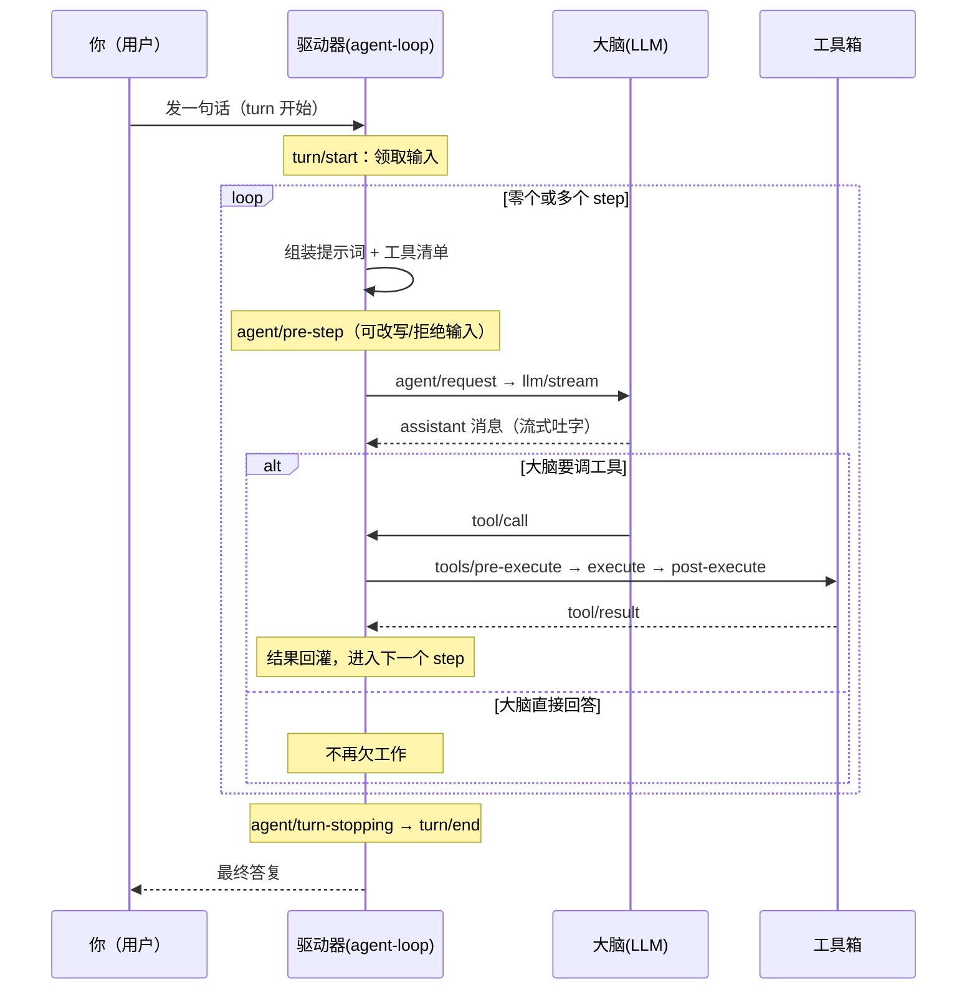
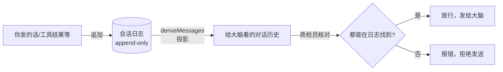
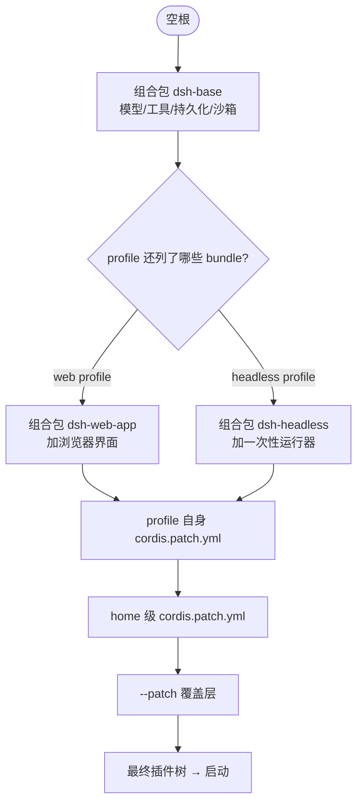
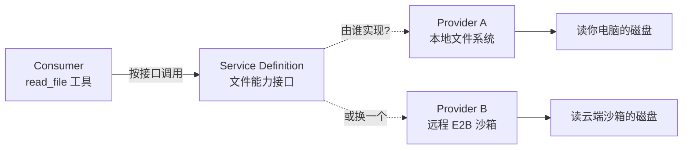
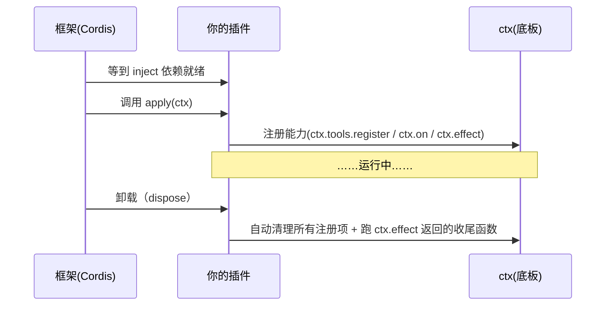
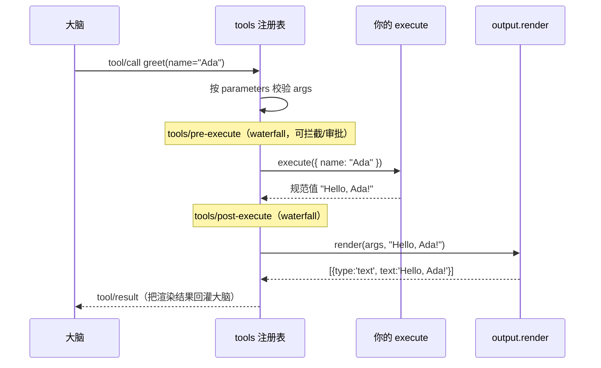
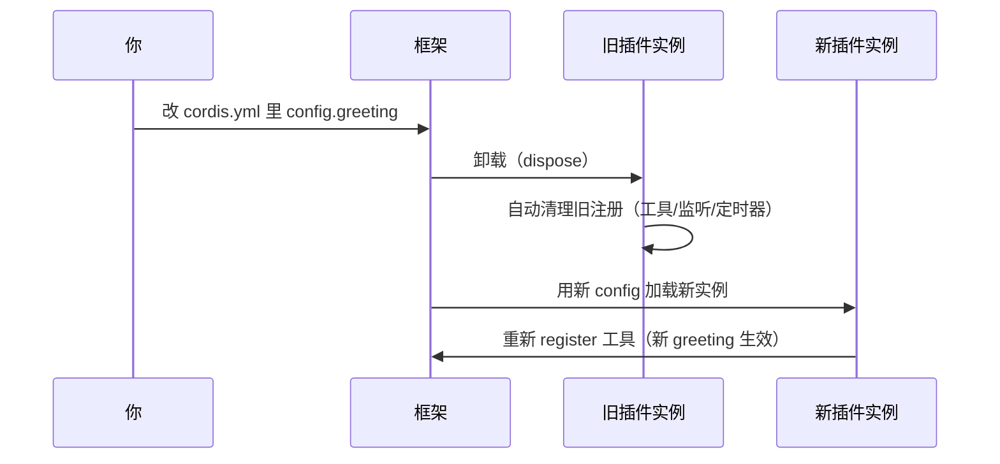
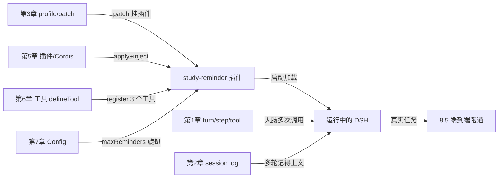
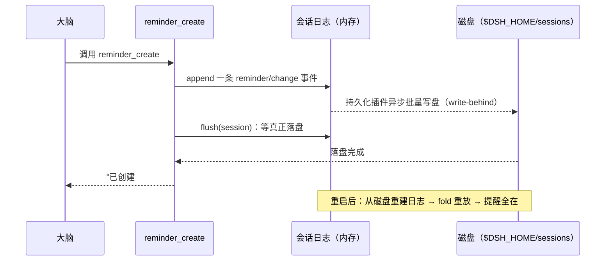

# DSH 实战教程

## 目录

- [第 0 章 准备出发](#第-0-章-准备出发)
- 第一部分 作为用户使用 DSH
  - [第 1 章 Agent、轮次、工具——DSH 怎么思考](#第-1-章-agent轮次工具dsh-怎么思考)
  - [第 2 章 会话与日志——DSH 的记忆本](#第-2-章-会话与日志dsh-的记忆本)
  - [第 3 章 Profile 与组合包——给 DSH 换装备](#第-3-章-profile-与组合包给-dsh-换装备)
  - [第 4 章 能力 seam——DSH 的可换零件](#第-4-章-能力-seamdsh-的可换零件)
- 第二部分 作为开发者扩展 DSH
  - [第 5 章 插件与 Cordis——给 DSH 装新器官](#第-5-章-插件与-cordis给-dsh-装新器官)
  - [第 6 章 开发一个工具——教 DSH 新本事](#第-6-章-开发一个工具教-dsh-新本事)
  - [第 7 章 插件配置——让你的插件可调](#第-7-章-插件配置让你的插件可调)
- 第三部分 端到端实战
  - [第 8 章 实战：打造你的"学习提醒管家"](#第-8-章-实战打造你的学习提醒管家)
- [附录 A 命令速查 / Windows 注意 / 排查 / 进阶路线](#附录-a-命令速查--windows-注意--排查--进阶路线)

***

# 第 0 章 准备出发

## 0.1 DSH 是什么

你大概用过网页版的 AI 聊天：输入一个问题，AI 回一段文字。好用，但有个天花板——它只能"说"，不能"做"。你问"帮我看看这个文件夹里有哪些文件"，它只能告诉你"我没法访问你的电脑"。

**DeepSeek Harness（简称 DSH）就是来拆掉这堵墙的。** 它让 AI 长出"手脚"：能看文件、能跑命令、能写代码、还能调用你给它装的各种工具。而且——它的每一个零件都能换、能加，像拼装一辆乐高车。

> **一句话定义**：DSH 是一个"一切皆插件"的 AI 智能体框架。你可以把它当成一个能动手干活的 AI 助手，同时也是一个可以自己加功能的"插件平台"。

### 类比：机器人管家

想象一个家用机器人管家：

```
┌─────────────────────────────────────────────┐
│            机器人管家（DSH）                  │
│                                               │
│   ┌─────────┐  ① 大脑：想下一步干啥           │
│   │  大脑   │  （agent loop 智能体循环）       │
│   └────┬────┘                                  │
│        │ ② 派活：用哪个工具                    │
│   ┌────▼────────────────────────────┐        │
│   │ 工具箱：手脚                      │        │
│   │  📁 读写文件  💻 跑命令  🌐 搜索  │        │
│   │  🧩 你自己加的工具 ...            │        │
│   └──────────────────────────────────┘        │
│        │ ③ 记事：把做过的事写进日记            │
│   ┌────▼────┐                                  │
│   │  日记本  │  （session log 会话日志）        │
│   └─────────┘                                  │
└─────────────────────────────────────────────┘
```

这本书三个核心，对应管家的三件套：

| 管家部件       | DSH 术语                                  | 本书章节      |
| ---------- | --------------------------------------- | --------- |
| 大脑（想下一步）   | **agent loop**（智能体循环）                   | 第 1 章     |
| 工具箱（动手干活）  | **tools**（工具）+ **capability seam**（能力缝） | 第 1、4、6 章 |
| 日记本（记做过的事） | **session log**（会话日志）                   | 第 2 章     |

而"一切皆插件"，意思是：连大脑、工具箱、日记本本身都是可以替换的零件。你嫌大脑不够聪明？换一个。你想给管家装个"发邮件"的手？加一个插件就行。这是第二部分（第 5–7 章）和第 8 章实战要讲的事。

***

## 0.2 你需要准备什么

DSH 是用 Node.js 写的。你需要三样东西：

### ① Node.js（运行环境）

DSH 要求 **Node.js ^22.19 或 >=24**。去 [nodejs.org](https://nodejs.org) 下载 LTS 版安装即可。

### ② 一个 DeepSeek API Key（让大脑通电）

DSH 的"大脑"需要调用 DeepSeek 的大模型。你需要一个 API Key：

1. 到 [DeepSeek 开放平台](https://platform.deepseek.com/) 注册并充值一点（几块钱够你跑完整本书的 DEMO）。
2. 在"API Keys"页面创建一个 Key，形如 `sk-xxxxxxxx`。
3. 把它记下来——待会儿要配置进环境变量。

### ③ DSH 本体

有两条路，**本书推荐从源码跑**（因为后面第 5–8 章你要改代码加插件）：

**路线 A：npx 秒开（只想先体验一下）**

```sh
npx @deepseek-ai/dsh web
```

**路线 B：从源码跑（推荐，本书用这条）**

```sh
git clone https://github.com/deepseek-ai/deepseek-harness.git
cd deepseek-harness

# 启用 pnpm（只需一次）
corepack enable
corepack prepare pnpm@11.7.0 --activate

pnpm install      # 下载依赖
pnpm run build    # 编译
```

> 关于 `corepack`/`pnpm`/`build` 哪些只需跑一次、哪些每次启动要跑，本书附录 A 有总结。简单记：装依赖和编译只在"依赖变了/代码变了"时重跑；平时启动只需 `pnpm dsh web`。

***

## 0.3 第一次启动：让管家说句话

把 API Key 配好（PowerShell 里临时设一个就行）：

```powershell
$env:DEEPSEEK_API_KEY = "sk-你刚才记下的那串"
```

然后在仓库根目录运行：

```sh
pnpm dsh web
```

看到类似下面的输出就成功了：

```
DSH Web UI: http://127.0.0.1:3080
```

浏览器打开 `http://127.0.0.1:3080`，你会看到一个聊天界面。在里面输入：

> 你好，请用一句话介绍你自己。

按回车，等几秒，管家就会回话。**恭喜，你的 DSH 已经活了。**

### 也可以用"一次性"模式跑一条任务

如果你不想开网页，只想让管家跑完一件事就走人，用 `headless` 模式：

```sh
pnpm dsh --profile headless "在当前目录新建一个 hello.txt，内容写：你好DSH"
```

它会：创建一个新的会话 → 让 AI 干活（可能调用文件工具）→ 打印最终答复 → 退出。你会在当前目录看到 `hello.txt` 被建出来了。

> 第一个用到的对照表：**web vs headless**

| <br /> | `dsh web` | `dsh --profile headless "任务"` |
| ------ | --------- | ----------------------------- |
| 形态     | 长驻网页，可多轮聊 | 一次性，跑完即退                      |
| 适合     | 边聊边试、长期使用 | 自动化脚本、批处理                     |
| 输出     | 浏览器界面     | 终端文本                          |

***

## 0.4 本书怎么用

- 每章结尾都有"动手清单"，建议你照着敲一遍。**只看不练，概念会像沙子一样从指缝漏掉。**
- 第 1–4 章是"用户篇"，你只需当用户用 DSH；第 5–7 章是"开发者篇"，开始写代码改 DSH；第 8 章把全部串成一个能跑的应用。
- 看不懂的代码段，先看右边注释，再看类比；实在卡住就跳过，继续往下读，等全貌清楚后回头再看往往就懂了。

准备好你的 Node、Key 和一个能敲命令的终端，翻到第 1 章，我们让管家正式上班。

***

# 第 1 章 Agent、轮次、工具——DSH 怎么思考

## 1.1 三个关键词：agent、turn、step

你在网页里打了一行字："帮我看看当前文件夹有什么文件，并读一下 README.md 的第一行。" 管家不是一句话答完的，它会经历一段"想—做—想—做"的过程。DSH 用三个词描述这个过程：

| 术语        | 中文  | 一句话解释             | 类比               |
| --------- | --- | ----------------- | ---------------- |
| **agent** | 智能体 | 干活的主体，DSH 里的"实习生" | 管家本人             |
| **turn**  | 轮次  | 你交的一件事，从领到活到干完交差  | 一次"任务交接"         |
| **step**  | 步骤  | 轮次里的一次"问大脑 + 调工具" | 实习生请教一次老师 + 动一次手 |

关键关系是：**一个 turn 包含零个或多个 step**。

```
你交的一件事（turn）
  ├── step 1：问大脑"我该干啥" → 大脑说"先列目录" → 调 ls 工具
  ├── step 2：把上一步结果交回大脑 → 大脑说"再读 README.md" → 调 read 工具
  └── step 3：把结果交回大脑 → 大脑说"齐活了，总结一下" → 直接回复你
turn 结束，交差
```

> **为什么强调"零个或多个 step"**：如果你只是闲聊"你好"，大脑一次就能答完、不用调工具，那这个 turn 里就只有一个 step；甚至极端情况 turn 里零个 step（被规则直接挡掉），但这次尝试仍会记进日志。DSH 不假装这件事没发生过。

## 1.2 一个 step 里面到底发生了什么

一个 step = 一次模型请求 + 这次请求触发的工具调用。把它拆开看：

```
┌──────────────────────── 一个 step ────────────────────────┐
│                                                            │
│  ① 组装"给大脑看的东西"                                      │
│     ├─ 历史对话（从日记本投影出来，见第 2 章）                │
│     ├─ 系统提示词（管家的人设 + 规则）                        │
│     └─ 工具清单（这次允许大脑用哪些工具 + 用法说明）          │
│                                                            │
│  ② 请求大脑（agent/request → llm/stream）                   │
│     大脑边想边吐字（流式 chunk），最后拼成一条 assistant 消息  │
│                                                            │
│  ③ 大脑可能说"我要用工具"（tool/call）                       │
│     └─ 执行工具（tools/pre-execute → execute → post-execute）│
│        └─ 工具结果回灌给大脑（tool/result）                  │
│                                                            │
│  ④ step 结束，判断要不要再来一个 step                         │
│                                                            │
└────────────────────────────────────────────────────────────┘
```

注意 ③：大脑每次回复有两种可能——**要么直接说话**（这就到 turn 尾巴了），**要么喊一个工具**（那就把工具结果塞回去，再来一个 step）。

## 1.3 用时序图看一轮完整 turn

下面这张 Mermaid 时序图，把上面文字描述的整个流程画成一张图。建议在 [mermaid.live](https://mermaid.live) 里粘贴预览，能看到箭头动起来更直观。

` ```mermaid `



> 图里那些 `agent/pre-step`、`tools/pre-execute` 是 DSH 的**事件**（扩展点）。现在你只要知道"它们是流程里可以挂钩子、插逻辑的位置"就行；第 5 章讲插件时会用到它们，第 4 章会专门讲能力事件。

## 1.4 第四个关键词：tool（工具）

工具就是管家"动手"的方式。DSH 自带一批常用工具，比如：

| 工具              | 干什么       | 类比     |
| --------------- | --------- | ------ |
| 文件读写（fs）        | 读、写、改、列文件 | 管家的文件夹 |
| 命令行（bash/shell） | 在系统里跑命令   | 管家的小锤子 |
| 搜索（web）         | 上网查       | 管家的浏览器 |
| todo\_write     | 记待办       | 管家的便签纸 |

每个工具都有三件套，这是后面第 6 章你自己写工具时要遵守的格式：

```
一个 tool = {
  名字        // 大脑用它时喊的名字，如 "read_file"
  参数说明     // schema：告诉大脑这个工具要哪些参数、什么类型
  执行函数     // 真正干活的代码：收到参数 → 返回结果
}
```

**工具清单会拼进"给大脑看的东西"里**，所以大脑才知道"哦，我手上有 read\_file 可以用"。这就是为什么说"工具 schema 加入提示词组装"。

## 1.5 动手 DEMO：让管家列目录、读文件

确保 `pnpm dsh web` 在跑、浏览器开着 `http://127.0.0.1:3080`、API Key 已配。

**DEMO 1：列目录**

在聊天框输入：

> 请列出当前工作目录下有哪些文件和文件夹。

观察管家会怎么做。它大概率会**调用一个命令行/文件工具**（界面里会显示工具调用的过程），然后告诉你结果。

> 想看到工具调用？Web UI 通常会把"管家正在调用 xxx 工具"显示出来。这一步就是在看图 1.3 里的 `tool/call → execute → result`。

**DEMO 2：读文件**

接着输入（让它接着上文）：

> 读一下 README.md 的前 20 行，然后用中文一句话总结它说了什么。

这次你会看到：管家先调工具读文件 → 把内容拿回来 → 再"想一下" → 给你总结。这就是**两个 step**串起来。

**DEMO 3：观察"step 串成 turn"**

问一个需要多步的任务：

> 先列出当前目录的文件，再挑一个 .md 文件读出来，最后告诉我它大概在讲什么。

这次数一数管家调了几次工具。每调一次工具，就是一个 step；全部干完交差，就是一个 turn 结束。

### 对照表：把概念对到你的观察

| 你在界面看到的            | 对应术语                       |
| ------------------ | -------------------------- |
| 你发的那句话             | turn 的输入                   |
| "正在调用 read\_file…" | 一个 step 里的 tool/call       |
| 管家吐字总结             | assistant 消息（可能是最后一个 step） |
| 从发话到管家说"完成"        | 一整个 turn                   |

## 1.6 本章小结

- **agent** 是主体，**turn** 是你交的一件事，**step** 是 turn 里一次"问大脑 + 调工具"。
- 一个 turn = 零或多个 step；大脑每次要么直接答（turn 快结束），要么喊工具（再来一个 step）。
- **tool** = 名字 + 参数说明 + 执行函数；工具清单会拼进给大脑看的东西里。
- 流程里那些 `agent/*`、`tools/*` 是**事件/扩展点**，是后面插插件的地方。

下一章我们看管家的"日记本"——会话日志，它是 step 之间能接上的根本原因。

***

# 第 2 章 会话与日志——DSH 的记忆本

## 2.1 为什么管家不会"失忆"

第 1 章的 DEMO 2 里，你先让管家列目录、再让它读 README，它"接着上文"读对了文件。这看似理所当然，背后却藏着一个关键设计：管家并不是把"上一句话"塞进脑子就行——它有一本**会话日志（session log）**，把发生过的一切都记下来，每次问大脑前再从这本日志里"投影"出该给大脑看的内容。

### 类比：值班日记本

想象工厂门卫的值班日记本：

```
┌─────────────── 值班日记本（session log）────────────────┐
│  8:00  来访：张三，找王工          ← 只能往后写，不能涂改 │
│  8:15  来访：李四，送快递                               │
│  9:00  电话：李五请假                                   │
│  ...                                                     │
│  每一条 = 一个"事件"，按时间顺序追加（append-only）     │
└──────────────────────────────────────────────────────────┘
```

这本日记有三个特点，正好对应 DSH 会话日志的三条性质：

| 值班日记                | DSH 会话日志                             |
| ------------------- | ------------------------------------ |
| 只能往后写、不能涂改          | **append-only（仅追加）**                 |
| 每条记一个"事实"（谁来了、谁打电话） | 每条是一个 **session event（会话事件）**        |
| 交接班时，新门卫翻日记就知道历史    | 模型历史由 `deriveMessages()` 从日志**投影**出来 |

> **关键认知**：DSH 里"管家记着的东西"和"管家给大脑看的东西"是同一份来源。日记本（日志）是**唯一真相**，大脑每次看到的对话历史，都是从这本日记里"挑出来、整理好"的一份投影。

## 2.2 一条 session event 长什么样

你在聊天里发"你好"，管家不会直接把"你好"两字丢给大脑。它会先往日志里追加一条事件，再从日志投影。常见的事件类型（DSH 里这些类型在一个叫 `SessionEventMap` 的表里统一登记）：

```
user/message      你发的一句话（追加进日志）
assistant/message 管家回的一句话
assistant/chunk   管家吐字过程中的一个个"碎块"（保证回放和界面流畅）
tool/call         管家喊了一个工具
tool/result       工具返回的结果
turn/*  step/*    轮次和步骤的边界标记
```

每一条事件都有结构，大致是：

```
一条 session event = {
  类型       // 比如 "user/message"
  内容       // 比如你说的那句话
  时间戳     // 什么时候记的
  其它字段   // 因类型而异
}
```

## 2.3 黄金铁律：模型可见即已记录

DSH 有一条铁律，叫 **"模型可见即已记录"（model-visible ⟺ logged）**：

> 抵达大脑请求的任何东西，都必须能从会话日志里重建。

为什么要这么死板？想象一个反面场景：管家偷偷把"用户偏好"塞进给大脑看的消息里，但没记进日志。结果——

- 大脑看到了，回复了；
- 可日志里没有这条"偏好"的痕迹；
- 下次重开会话想复原这次对话，就**对不上**了：日志显示大脑凭空"知道"了某个它不该知道的东西。

这条铁律把这种"暗箱操作"堵死了。推论很自然：

> **想给大脑塞一种新的、之前没有的输入？那就必须新增一种 session event 来记录它。**

这就像门卫想记一种新信息（比如"收到了一份快递"），就得先在日记本的目录里登记"快递"这一类条目怎么写，再开始记——否则后人翻日记看不懂。

### 一个运行时"质检员"

DSH 甚至有个运行时不变量，会断言"模型看到的一切都能从日志重建"。你可以理解成日记本旁边站着一个质检员，每次给大脑送材料前先核对：送出去的每一项，日记里都有对应记录。对不上就**报错**，绝不放行。

` ```mermaid `



## 2.4 日志的派生用途

这本日志不只是"管家脑子"的来源，DSH 的很多功能都是从它派生出来的：

| 功能      | 怎么从日志来                  |
| ------- | ----------------------- |
| 回放对话    | 按顺序读事件就能还原整个过程（包括吐字的碎块） |
| 界面显示    | UI 从日志渲染聊天记录，刷新/重开都一致   |
| 持久化     | 日志写到磁盘，下次启动能接着用         |
| 标题生成    | 用日志内容让模型起一个会话标题         |
| 遥测统计    | 从事件流统计工具调用次数、耗时等        |
| fork 分叉 | 从日志某处复制出一条"支线"会话        |

## 2.5 fork：从日记本里"分叉"出新会话

**fork（分叉）** 是日志的派生玩法之一。比如你和管家聊到一半，想"假如刚才换个方向会怎样"。你可以把当前会话在某个时间点 fork 出一份副本，在副本上聊另一个分支，原会话不受影响。

```
原会话日志：A → B → C → D
                         └─ 在 C 处 fork → 副本：A → B → C → (新的 E' → F')
                                              （原会话继续 C → D → ...）
```

> 调用层面：`ctx.sessions.fork(source, boundary?, childSessionId?)`。boundary 就是"从哪一刀切"。日常用 Web UI 的 fork 按钮即可（若有），不必写代码。

## 2.6 动手 DEMO：多轮对话 + 重启不丢

**DEMO 1：多轮，看管家"记得"上文**

`pnpm dsh web` 跑着，在同一个会话里依次发：

1. <br />

第 3 句管家能答对，是因为前两句都记进了日志，第 3 次问大脑前 `deriveMessages()` 把它们投影进了对话历史。

**DEMO 2：关掉再开，记忆还在**

1. 关掉浏览器标签页（**别关终端**，让 `dsh web` 一直跑）。
2. 重新打开 `http://127.0.0.1:3080`，找到刚才那个会话。
3. 问：> 你还记得我叫什么吗？

它还能答对——日志已经持久化在磁盘上（默认在你用户目录的 `.dsh` 文件夹里），重启不丢。这正是"日记本写到磁盘"的功劳。

> 想看看持久化在哪？DSH 默认把用户数据放在 `C:\Users\<你>\.dsh` 下（Windows）。会话日志就在里面的会话目录。本书附录 A 会列出具体路径。

**DEMO 3（可选）：用 headless 跑一次性会话**

```sh
pnpm dsh --profile headless "记住一个秘密数字 42，然后告诉我你记住了什么"
```

它会创建一个全新会话、跑完、打印答复、退出。这次会话也被持久化，只是你不继续聊了。它和 web 会话用的是同一套日志机制。

## 2.7 对照表：三个容易混的词

| 词                       | 是什么             | 比喻                |
| ----------------------- | --------------- | ----------------- |
| **session（会话）**         | 一段连续的对话线程，由日志支撑 | 一次"值班周期"          |
| **session log（会话日志）**   | 这段对话的所有事件，仅追加   | 值班日记本             |
| **model history（模型历史）** | 每次问大脑前从日志投影出的对话 | 翻日记摘出来的"给老师看的那几页" |

记住一句话：**日记本是真相，模型历史是投影。**

## 2.8 本章小结

- **会话日志**是 append-only 的事件流，是管家记忆的**唯一真相来源**。
- 大脑每次看到的对话历史，由 `deriveMessages()` 从日志**投影**出来。
- **铁律：模型可见即已记录**——想给大脑加一种新输入，就得新增一种 session event。
- 日志还派生出回放、持久化、标题、遥测、fork 等功能。
- 重启不丢，因为日志写到了磁盘。

下一章我们看怎么给管家"换装备"——Profile 与组合包，理解了它，你才知道管家启动时到底加载了哪些零件。

***

# 第 3 章 Profile 与组合包——给 DSH 换装备

## 3.1 同一个 DSH，为什么长得不一样

第 0 章你跑过两条命令：`dsh web` 开网页，`dsh --profile headless "任务"` 跑完即退。同一个 DSH、同一套代码，为什么一个长驻、一个一次性？因为它们启动时加载了**不同的零件组合**。DSH 用一套"穿搭"机制来描述这种组合，这套机制有三个词：

| 术语              | 中文  | 一句话                 | 类比       |
| --------------- | --- | ------------------- | -------- |
| **profile**     | 配置档 | 一个具名的"穿搭方案"         | 一整套穿搭    |
| **bundle（组合包）** | 组合包 | 一份可分发的零件包，贡献配置 + 代码 | 一件衣服     |
| **patch**       | 补丁  | 一层覆盖配置，能插入/替换条目     | 别在衣服上的胸针 |

一句话总括：**运行中的 DSH 是一棵插件树，启动时按顺序一层层叠出来。**

## 3.2 穿搭的层次：配置层叠

DSH 启动时，从一棵"空树"开始，按这个顺序一层层往上叠：

```
┌────────────────────────────────────────────────────────┐
│  ⑤ --patch 指定的覆盖层（命令行临时挂的，最优先）       │ ← 最上层，最后叠
├────────────────────────────────────────────────────────┤
│  ④ home 级 patch：$DSH_HOME/cordis.patch.yml           │   （全机生效）
├────────────────────────────────────────────────────────┤
│  ③ profile 自身 patch：profile 目录里的 cordis.patch.yml│   （这个 profile 专属）
├────────────────────────────────────────────────────────┤
│  ② profile 列出的各组合包（dsh.profile.bundles，按顺序）│   （每件衣服）
├────────────────────────────────────────────────────────┤
│  ① 空根                                                │ ← 最底层，最先
└────────────────────────────────────────────────────────┘
```

规则很简单：**后叠的在上、后叠的能覆盖先叠的**。一条 patch 要么按 `id` 定位某个已有条目并**替换它整个 config**，要么**插入新条目**。

` ```mermaid `



## 3.3 两个自带 profile

DSH 自带 `web` 和 `headless` 两个模板 profile，首次使用时自动初始化：

| profile    | 第一层（每个 profile 都有）                   | 额外层                           | 结果        |
| ---------- | ------------------------------------ | ----------------------------- | --------- |
| `web`      | `dsh-base`（模型适配器、工具、持久化、沙箱、设置、凭据、遥测） | `dsh-web-app`（加浏览器应用）         | 长驻网页，能多轮聊 |
| `headless` | `dsh-base`                           | `dsh-headless`（加一次性运行器，不带服务器） | 跑完即退      |

> `dsh-base` 是**每个 profile 的第一层**——它把"管家三件套"（大脑适配器、工具箱、日记本持久化）都装好了。`web`/`headless` 只是在其上分别加了"网页界面"或"一次性跑器"这件"外套"。
>
> 你也可以用 `dsh plugin --profile <name>` 创建全新的 profile，自由往里加/删组合包。本书第 8 章实战会用到这个能力。

## 3.4 动手 DEMO：看看你的管家到底穿了啥

**DEMO 1：打印 web 的配置树**

```sh
pnpm dsh --profile web --dump-config
```

终端会打印出一大串条目（每个条目是一个插件及其配置）。这就是"管家穿了哪些衣服"。你会看到 `dsh-base`、`dsh-web-app` 之类，以及它们各自的 config。

**DEMO 2：对比 headless**

```sh
pnpm dsh --profile headless --dump-config
```

和 DEMO 1 对比，能看到少了 `dsh-web-app`、多了 `dsh-headless`。**差异就在这几行配置里**——同一个管家，换个外套就是另一种用法。

**DEMO 3：用 --patch 临时别个"胸针"**

`--patch` 让你不动 profile、不写代码，临时加一层配置。我们先体验"挂一层空 patch 不报错"。在仓库根目录建一个文件 `my-patch.yml`：

```yaml
# 一条 insert：插入一个新条目（这里先插一个空配置占位，第 5 章会让它指向真实插件）
- insert:
    - id: my-demo-entry
      name: '@deepseek-ai/dsh-base'   # 复用一个已存在的包名，仅作演示
      config: {}
```

然后：

```sh
pnpm dsh --profile web --dump-config --patch ./my-patch.yml
```

对比 DEMO 1 的输出，你会发现多出了 `my-demo-entry` 这一条。这就是"别胸针"的效果——**临时、不持久**：不加 `--patch` 它就不存在。

> 想让某层 patch **每次启动都生效**？别用 `--patch`，把它合并进 profile 自身的 `cordis.patch.yml`（`$DSH_HOME/profiles/<name>/cordis.patch.yml`，针对单 profile）或 home 级的 `$DSH_HOME/cordis.patch.yml`（全机生效）。本书第 5 章和第 8 章会用到。

## 3.5 对照表：profile / bundle / patch

| <br />      | 是什么           | 粒度      | 持久？                                    | 谁定义                                         |
| ----------- | ------------- | ------- | -------------------------------------- | ------------------------------------------- |
| **profile** | 一套穿搭方案        | 整棵树     | 存在 `$DSH_HOME/profiles/<name>`         | `package.json` 的 `dsh.profile` 字段           |
| **bundle**  | 一件衣服（可分发的零件包） | 一组配置+代码 | 装在 profile 里                           | `package.json` 的 `dsh.bundle` 字段指向 patch 文件 |
| **patch**   | 别在衣服上的胸针      | 一层覆盖    | `--patch` 临时；写进 `cordis.patch.yml` 才持久 | YAML 文件                                     |

## 3.6 本章小结

- 运行中的 DSH = 一棵插件树，**从空根开始一层层叠**出来。
- 叠加顺序：组合包 → profile patch → home patch → `--patch` 覆盖；后叠在上、能覆盖先叠的。
- 自带 `web`/`headless` 两个模板 profile；`dsh-base` 是每个 profile 的第一层。
- `--dump-config` 能在不启动模型的前提下看完整配置树（**不需要 Key**，适合学习）。
- `--patch` 临时挂覆盖层；要持久就写进 `cordis.patch.yml`。

到这里，"用户篇"还差最后一块拼图：管家那些"手脚"（文件、命令行、终端）是怎么做到能整组换掉的？第 4 章讲"能力 seam"。

***

# 第 4 章 能力 seam——DSH 的可换零件

## 4.1 一种能力，三种角色

第 1 章说管家有"文件工具""命令行工具"。但仔细想：管家怎么知道"读文件"该找谁？读你电脑上的文件，和读一个云端沙箱里的文件，动作不一样，可对大脑来说都是"读文件"。DSH 把这件事拆成三个角色，合起来叫一个 **seam（能力缝）**：

| 角色                           | 中文 | 职责                  | USB 类比         |
| ---------------------------- | -- | ------------------- | -------------- |
| **Service Definition**（服务定义） | 接口 | 声明"能干啥、怎么调用"，不关心谁实现 | USB 标准协议       |
| **Service Provider**（服务提供方）  | 实现 | 真正干活的实现，可换          | 一个具体 U盘 / 移动硬盘 |
| **Consumer**（消费方）            | 使用 | 调用这能力的人，通常是面向大脑的工具  | 笔记本电脑（用 U盘）    |

> **seam 这个词**：本意是"接缝"。DSH 里它指"可以拆开换零件的那道缝"。一道 seam 必须三角色齐全；只写一个角色不算一道完整的能力。

```
┌───────────────────────────── 一道能力 seam ─────────────────────────────┐
│                                                                        │
│   ┌──────────────────┐  调用   ┌──────────────────┐  实现   ┌─────────┐ │
│   │Service Definition│ ──────▶│ Service Provider │ ───────▶│ 真实动作 │ │
│   │ （接口：读文件）    │        │ （本地 fs 提供方）  │         │ 读磁盘  │ │
│   └──────────────────┘        └──────────────────┘         └─────────┘ │
│            ▲                                                           │
│            │ 使用                                                       │
│   ┌────────┴─────────┐                                                 │
│   │ Consumer         │  （如 read_file 工具，面向大脑）                    │
│   └──────────────────┘                                                 │
└────────────────────────────────────────────────────────────────────────┘
```

` ```mermaid `



## 4.2 杀手锏：换一个提供方，整组零件一起搬家

seam 最大的威力是：**把一个提供方换掉，整个产品的行为就变了，而消费方一行不用改。**

举个例子（DSH 真实设计）：文件能力（`ctx.fs`）和进程能力（`ctx.subprocess`）共享同一个"执行世界"。你把这两个提供方从"本地"换成"远程 E2B 沙箱"，那么——

- Bash 工具（命令行）、PTY（终端）、LSP（语言服务器）**全都跟着搬到了云端沙箱**；
- 你不用为每个工具单独写"远程版"；
- 大脑那边看到的工具还是 `bash`、`read_file`，调用方式没变。

这就是"seam 是可换零件的接缝"在产品上的意义。换个提供方 = 给管家整组换"手脚"，大脑浑然不觉。

> 这也解释了为什么 DSH 敢说"一切皆插件、每一部分都能从配置替换"：因为大脑、工具、日记本、甚至 agent 循环本身，都是某道 seam 的提供方。

## 4.3 另一种扩展：能力事件

除了"换提供方"，还有一类扩展叫**能力事件**。它的作用是：不用把整个提供方换掉，只在某道能力缝上**挂策略/适配器**。常见的事件域：

| 事件域           | 挂的策略举例            |
| ------------- | ----------------- |
| `fs/*`        | 文件读写策略（比如禁止写某些目录） |
| `tools/*`     | 工具执行前/后的拦截（审批、改写） |
| `telemetry/*` | 遥测埋点              |

> 这些事件里，`tools/pre-execute`、`tools/execute`、`tools/post-execute`（第 1 章时序图里见过）是**waterfall（瀑布式）事件：监听器**必须调 `next()` 把接力棒传下去，否则链条断掉。第 5 章讲插件时你会亲手挂一个。

## 4.4 动手 DEMO：换一道能力——给管家接上"记忆"

我们用官方 `mcp-memory` 示例，给管家新增一道"长期记忆"能力。这个例子完美展示了 seam：DSH 不关心记忆服务器是谁，只要它符合 MCP 接口，就能作为提供方接进来。

**DEMO 1：读懂这个 patch 在干什么**

先看一眼源代码仓库里的示例 patch(examples\mcp-memory\memorix.cordis.yml)：

```
# Opt-in reference for Memorix 1.3.0. Install the pinned `memorix` executable
# first; DSH starts it but does not run a package manager.
- insert:
    - id: memory-memorix
      name: '@deepseek-ai/dsh-mcp-client'
      config:
        serverName: memorix
        transport: stdio
        command: memorix
        args: [serve]
        cwd: !!js process.cwd()

```

你会看到它往配置树里 `insert` 了一个 `@deepseek-ai/dsh-mcp-client` 条目，配置了 `serverName`、`transport: stdio`、`command: memorix` 等。**这就是"挂一个新提供方"**：DSH 启动这个子进程、发现它提供的工具、以 `mcp__memorix__<tool>` 的名字暴露给大脑。

**DEMO 2：真跑一次**

```sh
# 1. 装 memorix（一个本地记忆服务器，纯 Node，无需 Key）
npm install --global memorix@1.3.0

# 2. 挂上这道能力再启动 web
pnpm dsh web --patch examples/mcp-memory/memorix.cordis.yml
```

打开 `http://127.0.0.1:3080`，等启动日志里出现 `mcp__memorix__...` 工具就绪后，按官方示例的验证步骤试：

1. 在会话 A 里说：> 记住我的幸运数字是 7。
   → 管家会调用 memorix 的写入工具。
2. 新建会话 B（同一个运行的 host，别重启），问：> 查一下记忆，我的幸运数字是多少？
   → 管家调用 memorix 的搜索工具，答出 7。

**这道 seam 的意义**：A、B 是两个不同会话，各自的"日记本"互不相通；但它们共享了同一个"长期记忆提供方"，所以信息能跨会话留存。而这一切，DSH 本体一行没改——只是 `--patch` 挂了个提供方。

> 装不动 memorix 也没关系，重点是理解：**一道 seam = 定义 + 提供方 + 消费方，换/加提供方就改变能力，不动 DSH 本体。**

## 4.5 对照表：三种扩展点怎么选

| 我想……           | 用什么                                   |
| -------------- | ------------------------------------- |
| 整组换手脚（如本地→沙箱）  | 换一个 **seam 的 Provider**               |
| 加一道全新能力（如长期记忆） | 挂一个新 Provider（经 `--patch` 或写进 patch）  |
| 只在某能力上加个策略/拦截  | 监听 **能力事件**（`fs/*`、`tools/*`）         |
| 拦截整轮对话或请求      | 监听 **agent 事件**（第 1 章时序图里的 `agent/*`） |
| 记一个要持久化的事实     | 追加 **会话事件**（第 2 章）                    |

## 4.6 用户篇收尾

到这里，"用户篇"四个核心概念你都见过：

- 第 1 章：agent / turn / step / tool（管家怎么干活）
- 第 2 章：session log（管家怎么记）
- 第 3 章：profile / bundle / patch（管家怎么穿装备）
- 第 4 章：capability seam（管家怎么换手脚）

你已经能**用** DSH 了。接下来"开发者篇"教你**改** DSH——从写第一个插件开始。第 5 章，我们让管家长出一个你自己造的"新器官"。

***

# 第 5 章 插件与 Cordis——给 DSH 装新器官

## 5.1 插件是什么

前 4 章你都是"用"管家，没动过它的零件。现在你要亲手给它加一个零件。DSH 里，**插件（plugin）就是一个导出** **`apply`** **函数的 TypeScript 模块**。框架加载它时，会调用 `apply(ctx)`，传进来一个 `ctx`（上下文对象），你在 `apply` 里通过 `ctx` 注册能力。

最小插件长这样：

```ts
import type { Context } from '@deepseek-ai/cordis'  // 框架的类型

export const name = 'my-plugin'                      // 插件名（必需）

export function apply(ctx: Context) {                // 框架加载时调用
  // 在这里用 ctx 注册能力
}
```

四样东西，记牢：

| 部件                           | 作用                 |
| ---------------------------- | ------------------ |
| `import type { Context }`    | 引入框架类型（只是类型，不占运行时） |
| `export const name`          | 插件名，框架靠它识别         |
| `export function apply(ctx)` | 入口函数，框架加载时调用       |
| `ctx`                        | 上下文对象，**一切注册都通过它** |

### 类比：乐高积木 + 公共底板

- **插件 = 一块乐高积木**：自带凸起（要注册的能力）。
- **`ctx`** **= 那块公共底板**：所有积木都插在同一块底板上，积木之间通过底板互通。
- **`apply(ctx)`** **= 把这块积木按到底板上**的动作：按下去的瞬间，积木的凸起就和底板的孔位连上了。

```
   积木A（hello 插件）        积木B（工具插件）
      │ apply(ctx)              │ apply(ctx)
      ▼                         ▼
   ┌─────────────────────────────────────┐
   │            ctx（公共底板）            │
   │   tools  llm  sessions  fs  ...     │  ← 各种"孔位"（服务）
   └─────────────────────────────────────┘
```

> 这个底板有个名字：**Cordis**。它是 DSH 底层的框架——插件向共享 `ctx` 贡献服务、事件和可逆副作用。DSH 自己的每一部分（大脑、工具箱、日记本、甚至 agent 循环）也都是插在这块底板上的积木。这就是"一切皆插件"的字面含义。

## 5.2 三种积木形态

插件有三种写法，**大多数情况函数形态够用**：

```ts
// 形态①：函数（最常用）
export const name = 'my-plugin'
export function apply(ctx: Context) { /* ... */ }
```

```ts
// 形态②：对象
export default {
  name: 'my-plugin',
  apply(ctx: Context) { /* ... */ },
}
```

```ts
// 形态③：类（要向别的插件"提供"服务时才用）
import { Service, type Context } from '@deepseek-ai/cordis'
export default class MyService extends Service {
  static inject = ['tools']
  constructor(ctx: Context) { super(ctx, 'myService') }
}
```

> 本书 DEMO 全用形态①。形态③ 是"我要给别人提供服务"时才上，第 8 章实战如果用到会再讲。

## 5.3 两件必学机制：自动清理 与 声明依赖

### ① 自动清理（effect）

通过 `ctx` 注册的任何东西——事件监听、工具、定时器——**插件卸载时框架会自动清理**，你不用手动 `removeListener` / `clearInterval`。

但如果你有"需要手动收尾的资源"（比如一个网络连接），就用 `ctx.effect()` 告诉框架怎么收：

```ts
export function apply(ctx: Context) {
  ctx.effect(() => {
    const timer = setInterval(() => console.log('heartbeat'), 5000)
    // 返回的函数 = 卸载时执行的清理动作
    return () => clearInterval(timer)
  })
}
```

**类比**：积木自带"退场清扫员"。你只要在 `ctx.effect` 里写好"怎么收尾"，拔积木时它自动照做，底板不留垃圾。

### ② 声明依赖（inject）

如果你的插件要用别的服务（比如 `tools`、`llm`），必须声明 `inject`，框架才会**等这些服务就绪后再加载你的插件**：

```ts
export const name = 'my-tool-plugin'
export const inject = ['tools']          // 声明：我需要 tools 服务
export function apply(ctx: Context) {
  // 到这里 ctx.tools 一定就绪了，可以放心用
  ctx.tools.register(/* ... */)
}
```

**类比**：积木上标着"我需要底板上有 tools 这个孔位才能工作"。框架看到标签，会先把提供 `tools` 的积木按好，再按你这块。

### 插件生命周期

` ```mermaid `



## 5.4 动手 DEMO：第一个插件 hello-plugin

我们让管家启动时在终端喊一句"我加载了！"。

### 步骤 1：建项目目录

在仓库根目录下建一个临时目录（官方教程也叫 `scratch-plugin`）：

```sh
# 在 deepseek-harness 源代码仓库下
mkdir scratch-plugin
mkdir scratch-plugin\src
```

### 步骤 2：写插件文件

创建 `scratch-plugin/src/hello-plugin.ts`，内容：

```ts
import type { Context } from '@deepseek-ai/cordis'  // 框架类型

export const name = 'hello-plugin'                  // 插件名

export function apply(ctx: Context) {              // 加载时调用
  // 依赖就绪后才会跑到这里
  console.log('[hello-plugin] 我被加载啦！')
}
```

### 步骤 3：写 patch 文件（告诉 DSH 去哪找这块积木）

创建 `scratch-plugin/cordis.yml`：

```yaml
# insert：往配置树插入新条目
- insert:
    - id: hello
      # 注意：必须是绝对路径！把下面换成你的真实路径
      name: 'file:///D:/works/deepseek-harness/scratch-plugin/src/hello-plugin.ts'
```

> **Windows 路径提醒（重要）**：插件行的 `name` 会被当作 ESM 模块地址直接 `import`。macOS/Linux 写普通绝对路径即可（`/works/deepseek-harness/...`）；**Windows 下盘符路径（`d:/...`）不是合法的模块地址，必须加 `file:///` 前缀**（三个斜杠），如 `file:///D:/works/...`。直接写 `d:/...` 会报 `ERR_UNSUPPORTED_ESM_URL_SCHEME`（详见附录 A.3）。YAML 里别用反斜杠（会被当转义）；路径含空格时把空格写成 `%20`。

### 步骤 4：挂上 patch 启动

```sh
pnpm dsh web --patch ./scratch-plugin/cordis.yml
```

启动过程中，终端会打印：

```
[hello-plugin] 我被加载啦！
```

**恭喜，你亲手给管家加了一个器官。** 浏览器打开 `http://127.0.0.1:3080`，虽然这个器官还不会"干活"（没注册任何能力），但它确实被装上了。

### 步骤 5（可选）：验证"自动清理"

把 `hello-plugin.ts` 改成带 `effect` 的版本：

```ts
import type { Context } from '@deepseek-ai/cordis'

export const name = 'hello-plugin'

export function apply(ctx: Context) {
  console.log('[hello-plugin] 加载')
  ctx.effect(() => {
    const t = setInterval(() => console.log('[hello-plugin] heartbeat'), 2000)
    return () => console.log('[hello-plugin] 被卸载，清理定时器')  // 卸载时跑
  })
}
```

重启 `dsh web`，会每 2 秒看到 heartbeat。按 `Ctrl+C` 关掉时（框架走卸载流程），你会看到"被卸载，清理定时器"。这就是自动清理在干活——虽然进程马上要退，但在常驻场景下，单个插件被热重载/替换时，这套清理保证了底板不留垃圾。

## 5.5 对照表：插件四件套

| 部件           | 必须？ | 作用                      |
| ------------ | --- | ----------------------- |
| `name`       | 是   | 插件标识                    |
| `apply(ctx)` | 是   | 入口，注册能力                 |
| `inject`     | 看情况 | 声明依赖的服务，框架保证就绪后再跑 apply |
| `ctx.effect` | 看情况 | 注册需要手动收尾的资源             |

## 5.6 本章小结

- **插件** = 导出 `apply(ctx)` 的 TS 模块；**`ctx`** 是所有插件共享的公共底板（Cordis）。
- 三种形态：函数（常用）/ 对象 / 类（要提供服务时用）。
- **自动清理**：通过 `ctx` 注册的东西卸载时自动撤销；手动资源用 `ctx.effect()` 返回收尾函数。
- **声明依赖**：`inject = ['tools', ...]`，框架保证依赖就绪后才跑 `apply`。
- 用 `--patch 一个 cordis.yml` 把本地插件挂进 DSH；`name` 必须是**绝对路径**（Windows 下用 `file:///` 前缀，如 `file:///D:/works/...`）。

但 hello-plugin 只会打印日志，还不会"干活"。第 6 章，我们让管家学会一件新本事——注册一个真工具，让大脑能调用它。

***

# 第 6 章 开发一个工具——教 DSH 新本事

## 6.1 回顾：一个工具是什么

第 1 章说过，工具三件套是"名字 + 参数说明 + 执行函数"。现在我们把它精确化成 DSH 的写法。一个工具实际上有**四件套**，多了一个 `output`：

```
一个 tool = {
  name         // 工具名（大脑喊它时用）
  description  // 给大脑看的说明（大脑据此判断"要不要用这个工具"）
  parameters   // 参数说明（schema）：要哪些参数、什么类型、必填吗
  execute      // 真正干活的函数：拿到参数 → 返回"规范值"
  output       // 输出说明：规范值的结构 + 怎么把它渲染成"给大脑看的内容"
}
```

为什么要拆 `execute` 和 `output`？这是 DSH 的精妙处：

- `execute` 返回一个**规范值（canonical value）**——就是一段结构化数据。
- `output.render` 把这个规范值**渲染**成大脑能消化的内容（通常是文本）。

这么拆，让"工具产出了什么"和"怎么讲给大脑听"分开：同一份规范值，可以渲染成文字、渲染成表格、渲染成带样式的卡片，而 `execute` 的逻辑不用改。

### 类比：餐厅点菜

- `name` = 菜名："番茄炒蛋"
- `description` = 菜单上的介绍："家常菜，下饭"（顾客据此决定点不点）
- `parameters` = 点菜时要说明的："几份辣度、要不要葱"
- `execute` = 后厨真的炒出来 → 产出一盘菜（规范值）
- `output.render` = 服务员把这盘菜**摆成什么样端上桌**：装盘、配卡片说明、配图……菜还是那盘菜，呈现方式可变。

## 6.2 defineTool：工具的写法

DSH 提供 `defineTool` 帮你把四件套组装成一个工具对象。先看官方的最小例子——一个 `greet` 工具：

```ts
import type { Context } from '@deepseek-ai/cordis'
import { defineTool } from '@deepseek-ai/dsh-tools'   // 工具定义助手

export const name = 'greet-tool'
export const inject = ['tools']                        // 等 tools 服务就绪

export function apply(ctx: Context) {
  ctx.tools.register(defineTool({
    name: 'greet',                                     // 工具名
    description: 'Greet someone by name.',             // 给大脑的说明
    parameters: {                                      // 参数 schema
      name: { type: 'string', required: true, description: 'The name to greet' },
    },
    output: {                                          // 输出说明
      schema: { type: 'string' },                      // 规范值结构
      render: (_args, value) => [{ type: 'text', text: value }],  // 渲染成文本
    },
    async execute(args) {                              // 干活
      return `Hello, ${args.name}!`                    // 返回规范值（一个字符串）
    },
  }))
}
```

逐段读：

| 段                         | 作用                                                 |
| ------------------------- | -------------------------------------------------- |
| `inject = ['tools']`      | 声明依赖 `tools` 服务，框架保证它就绪后才跑 `apply`                 |
| `ctx.tools.register(...)` | 把这个工具注册到底板的工具注册表里                                  |
| `defineTool({...})`       | 把四件套打包成工具对象                                        |
| `parameters`              | 参数 schema；`defineTool` 会**自动推导并校验** `args`，你不用手写校验 |
| `async execute(args)`     | 拿到校验过的参数，返回**规范值**                                 |
| `output.schema`           | 声明规范值长什么样                                          |
| `output.render`           | 把规范值转成给大脑看的内容数组（这里是纯文本）                            |

> `parameters` 自动校验意味着：大脑要是乱传参（比如 `name` 给了个数字），框架在调 `execute` 前就拦下了，你的 `execute` 里可以放心假设参数是对的。

## 6.3 一次工具调用在流水线里的位置

第 1 章时序图里 `tool/call → tools/pre-execute → execute → post-execute → tool/result` 那一段，放大看就是：

` ```mermaid `



注意两个 waterfall 钩子 `tools/pre-execute` 和 `tools/post-execute`——你可以挂监听器做审批、改写、日志，但**必须调** **`next()`** 把接力棒传下去（第 4 章提过）。

## 6.4 动手 DEMO：让管家学会"问候"

沿用第 5 章的 `scratch-plugin` 目录。把 `scratch-plugin/src/my-plugin.ts`（或新建一个 `greet-tool.ts`）替换/新建为 6.2 的代码。如果你的 `cordis.yml` 里 `name` 指向的是 `my-plugin.ts`，就改指向新文件，或直接覆盖 `my-plugin.ts`：

```yaml
- insert:
    - id: greet
      name: 'file:///D:/works/deepseek-harness/scratch-plugin/src/greet-tool.ts'
```

启动：

```sh
pnpm dsh web --patch ./scratch-plugin/cordis.yml
```

打开 `http://127.0.0.1:3080`，输入：

> Use the greet tool to greet Ada.

你会看到：大脑决定调用 `greet` 工具（界面显示工具调用）→ 工具返回 `Hello, Ada!` → 大脑把这个结果组织进回复。**管家学会新本事了。**

试试让大脑自己挑参数：

> 我有个朋友叫 Grace，帮我跟她打个招呼。

大脑会自己从话里抠出 `name=Grace`，调 `greet`。这就是 `description` + `parameters` 的作用——它们拼进给大脑看的东西里，大脑据此知道"有这工具、怎么用"。

## 6.5 小练习：再加一个掷骰子工具

在同一个 `apply` 里再 `register` 一个工具，体会"一个插件能注册多个工具"：

```ts
import type { Context } from '@deepseek-ai/cordis'
import { defineTool } from '@deepseek-ai/dsh-tools'

export const name = 'my-tools'
export const inject = ['tools']

export function apply(ctx: Context) {
  // 工具①：greet
  ctx.tools.register(defineTool({
    name: 'greet',
    description: 'Greet someone by name.',
    parameters: { name: { type: 'string', required: true, description: '名字' } },
    output: { schema: { type: 'string' }, render: (_a, v) => [{ type: 'text', text: v }] },
    async execute(args) { return `Hello, ${args.name}!` },
  }))

  // 工具②：掷骰子
  ctx.tools.register(defineTool({
    name: 'roll_dice',
    description: 'Roll an n-sided die and return a number from 1 to n.',
    parameters: { sides: { type: 'number', required: false, description: '面数，默认6' } },
    output: { schema: { type: 'number' }, render: (_a, v) => [{ type: 'text', text: String(v) }] },
    async execute(args) {
      const n = args.sides ?? 6           // 没传就用 6
      return Math.floor(Math.random() * n) + 1
    },
  }))
}
```

重启后问管家：> 帮我掷一次 20 面骰子。 看它会不会调 `roll_dice(sides=20)`。

> `sides` 是 `required: false`，所以大脑不传也能跑（`execute` 里 `?? 6` 兜底）。可选参数就是这么写的。

## 6.6 对照表：parameters vs output

| <br /> | parameters                          | output                          |
| ------ | ----------------------------------- | ------------------------------- |
| 描述的是   | **进**（大脑传给工具的参数）                    | **出**（工具返回给大脑的内容）               |
| 关键字段   | `type` / `required` / `description` | `schema`（规范值结构）+ `render`（渲染方式） |
| 谁来校验   | `defineTool` 自动推导并校验                | `execute` 返回值要符合 `schema`       |
| 谁来用    | 框架校验后传给 `execute`                   | `render` 转成 model-facing 内容回灌大脑 |

## 6.7 本章小结

- 一个工具 = `name` + `description` + `parameters` + `execute` + `output`（四件套加 output）。
- `defineTool` 帮你打包；`parameters` 自动推导校验 `args`，`execute` 返回**规范值**，`output.render` 把规范值渲染成大脑能看的内容。
- 用 `ctx.tools.register(...)` 注册；声明 `inject = ['tools']` 保证注册表就绪。
- 一个插件可注册多个工具；参数可用 `required: false` + 兜底默认值做可选。
- 工具调用走 `tools/pre-execute → execute → post-execute → render → tool/result` 流水线，其中两个 `tools/*` 是 waterfall 钩子。

`greet` 的问候语是写死在代码里的"Hello,"。要是你想把它改成"你好"或"嗨"，就得改代码重编——不够灵活。第 7 章，我们让插件的某些值**可从配置改**，不动代码。

***

# 第 7 章 插件配置——让你的插件可调

## 7.1 问题：写死的值改不动

第 6 章的 `greet` 里，问候前缀 `Hello,` 是写死在 `execute` 里的。要换成中文"你好"，得改 `.ts` 源码、重启。如果这个插件打包发给别人用，别人想改就更难了——他得会改你的源码。

DSH 的约定很直白：**凡是不同的部署可能要用不同值的参数，都应该是配置字段，能从** **`cordis.yml`** **改，不动代码。**

### 类比：电器的旋钮

微波炉加热时间不用拆开电路板改——面板上有个旋钮。插件也一样：把"可能要调的值"做成旋钮（配置字段），用户在 `cordis.yml` 里拧它，你的代码里只读这个值，不写死。

```
   cordis.yml（控制面板）            插件代码（电路）
   ┌────────────────────┐           ┌────────────────────┐
   │  greeting: "你好"  │ ──旋钮──▶ │  config.greeting    │ ──▶ execute()
   │  maxRetries: 5     │           │  config.maxRetries  │
   └────────────────────┘           └────────────────────┘
```

## 7.2 三件套：Config 类型 + Schema + apply 第二参数

让插件可配置，要加三样东西：

1. **`Config`** **接口**：用 TS 描述配置长什么样。
2. **`Config`** **schema**（同名导出）：用 Schemastery 描述字段、类型、默认值、校验。**默认值写在 schema 里**。
3. **`apply(ctx, config)`**：apply 多收一个 `config` 参数，里面是校验过、填好默认值的配置。

把第 6 章的 `greet` 改成可配置问候语：

```ts
import type { Context } from '@deepseek-ai/cordis'
import Schema from '@deepseek-ai/schemastery'        // schema 库
import { defineTool } from '@deepseek-ai/dsh-tools'

export const name = 'greet-tool'
export const inject = ['tools']

// ① Config 接口：描述配置
export interface Config {
  greeting: string       // 问候前缀，比如 "Hello" / "你好"
  maxRetries: number
  verbose?: boolean
}

// ② Config schema：字段 + 类型 + 默认值（默认值写这里！）
export const Config: Schema<Config> = Schema.object({
  greeting: Schema.string().default('Hello'),   // 默认 "Hello"
  maxRetries: Schema.number().default(3),
  verbose: Schema.boolean().default(false),
})

// ③ apply 收第二个参数 config
export function apply(ctx: Context, config: Config) {
  ctx.tools.register(defineTool({
    name: 'greet',
    description: 'Greet someone by name.',
    parameters: { name: { type: 'string', required: true, description: '名字' } },
    output: { schema: { type: 'string' }, render: (_a, v) => [{ type: 'text', text: v }] },
    async execute(args) {
      // 用 config.greeting，不再写死
      return `${config.greeting}, ${args.name}!`
    },
  }))
}
```

> 注意 `Config` 同时是**接口名**和**导出的 schema 变量名**——同名。Cordis 找的就是这个导出的 `Config`。**别导出一个普通对象当 Config**，它必须满足 Standard Schema 接口（用 Schemastery 就对了）。

## 7.3 在 cordis.yml 里拧旋钮

在 patch 文件的条目里加 `config`：

```yaml
- insert:
    - id: greet
      name: 'file:///D:/works/deepseek-harness/scratch-plugin/src/greet-tool.ts'
      config:                          # 这里拧旋钮
        greeting: '你好'
        maxRetries: 5
        # verbose 不写 → 用默认 false
```

启动后，`greet` 的输出就变成"你好, Ada!"。**一行代码没改**，只改了 YAML。

> 默认值写在 schema 里（`.default('Hello')`），不写在 `Config` 接口里。cordis.yml 没提供的字段，Cordis 会用 schema 默认值补齐——所以 `verbose` 没写也不报错。

## 7.4 校验：配错了响亮报错

Schema 不只是"填默认值"，还会在**加载时校验**。配错就**加载失败**，给你明确错误，不会"静默用错值"。两个常用校验招式：

```ts
export const Config = Schema.object({
  // 必填：不提供就报错
  apiKey: Schema.string().required(),
  // 枚举：只允许这几个值
  mode: Schema.union(['fast', 'accurate']).default('fast'),
})
```

```
没配 apiKey → 加载报错："apiKey is required"
mode 配了 "slow" → 加载报错："mode must be one of fast, accurate"
```

这叫 **"misconfiguration fails loud（配错就响亮失败）"**——DSH 的硬约定：能在加载时就发现的问题，绝不默默吞掉。

## 7.5 配置改了会怎样：HMR 热重载

改了 `cordis.yml` 里某插件的 `config` 后，框架会**卸载旧实例、加载新实例**——这就是热重载（HMR）。因为第 5 章的"注册都是 effect、卸载自动清理"，替换不会留旧注册的垃圾：

` ```mermaid `



> 实操中，把 `greeting: '你好'` 改成 `'嗨'` 保存，正在跑的 `dsh web`（如果开了文件监听）会自动重载这个插件，下次 `greet` 就输出"嗨, ..."。没开监听就重启一次。

## 7.6 动手 DEMO：给 greet 加可调问候语

**步骤 1**：把 7.2 的代码写进 `scratch-plugin/src/greet-tool.ts`（覆盖第 6 章的版本）。

**步骤 2**：`scratch-plugin/cordis.yml` 用 7.3 的版本（带 `config: greeting: '你好'`）。

**步骤 3**：启动：

```sh
pnpm dsh web --patch ./scratch-plugin/cordis.yml
```

在网页里问：> 用 greet 跟小明打个招呼。 → 输出"你好, 小明!"

**步骤 4**：改 `greeting: '嗨'`，重启（或等 HMR），再问同样的话 → 输出"嗨, 小明!"。**没改一行代码。**

**步骤 5（验证校验）**：故意把 `maxRetries` 写成字符串 `"abc"`，重启 → 加载报错，告诉你类型不对。修回数字才恢复。这就是"fails loud"。

## 7.7 对照表：写死 vs 配置

| <br /> | 写死在代码里  | 做成 Config 字段        |
| ------ | ------- | ------------------- |
| 改值要改   | 源码 + 重编 | `cordis.yml`        |
| 发给别人改  | 他得会改你代码 | 他拧 YAML 旋钮即可        |
| 默认值在哪  | 代码常量    | schema `.default()` |
| 配错表现   | 可能静默用错值 | 加载时响亮报错             |
| 改了生效   | 重编重启    | HMR 自动重载            |

## 7.8 本章小结

- 让插件可调三件套：**`Config`** **接口** + **`Config`** **schema（Schemastery，默认值写这里）** + **`apply(ctx, config)`** **第二参数**。
- 默认值写在 schema，不写在接口；cordis.yml 没给的字段用默认补齐。
- schema 在加载时校验，**配错响亮报错**，不静默吞。
- 改 config 触发 **HMR**：旧实例卸载（自动清理）+ 新实例加载。
- DSH 约定：**部署可能变动的参数都做成 Config 字段**，不写死。

开发者篇到此结束。你已经会：写插件（第 5 章）、写工具（第 6 章）、让插件可配置（第 7 章）。第 8 章把这一切揉成一个能跑的真应用。

***

# 第 8 章 实战：打造你的"学习提醒管家"

这一章把前 7 章的概念全部用上，做一个能跑的小应用：一个**学习提醒管家**——你用自然语言跟管家说"帮我安排这周的学习提醒"，它会调用你自己写的插件工具去**创建 / 列出 / 删除**提醒。

读完本章，你会有：一个自定义插件（3 个工具 + 可配置），用 `--patch` 挂进 DSH，再让大脑实际调用它解决一个真实任务。

## 8.1 需求与设计

**用户故事**：我对管家说——

> 帮我安排这周的学习提醒：周一复习数学第三章，周三交语文作业，周五背 30 个英语单词。然后列出来给我看。

我期望管家会**多次调用** `reminder_create`（创建 3 条），再调一次 `reminder_list`（列出来）。这就是第 1 章的"一个 turn = 多个 step"在真实场景里的样子。

**三个工具：**

| 工具                | 参数                                       | 作用           |
| ----------------- | ---------------------------------------- | ------------ |
| `reminder_create` | `title`（必填）、`due`（必填，`YYYY-MM-DD HH:MM`） | 建一条提醒，返回新 id |
| `reminder_list`   | 无                                        | 列出全部提醒       |
| `reminder_delete` | `id`（必填）                                 | 按 id 删除一条    |

**两个可配置项（第 7 章旋钮）：**

| 配置                   | 默认 | 作用                           |
| -------------------- | -- | ---------------------------- |
| `maxReminders`       | 50 | 单实例最多存多少条，防止失控               |
| `defaultLeadMinutes` | 30 | （本 DEMO 留作扩展：创建时没给 due 的提前量） |

**存储**：为聚焦"插件+工具+配置"的串联，本 DEMO 用**进程内存 Map** 存（重启即失）。第 8.6 节会讲怎么升级成持久化，并指向官方 `web-schedule` 的真实实现。

## 8.2 串联图：本 DEMO 用到前 7 章的哪些概念

` ```mermaid `



## 8.3 步骤 1：写插件代码

新建 `study-reminder/src/index.ts`（沿用 `scratch-plugin` 目录也行，这里独立命名更清楚）：

```ts
import type { Context } from '@deepseek-ai/cordis'
import Schema from '@deepseek-ai/schemastery'
import { defineTool } from '@deepseek-ai/dsh-tools'

export const name = 'study-reminder'
export const inject = ['tools']          // 第5章：声明依赖 tools 服务

// 第7章：Config 接口
export interface Reminder {
  id: number
  title: string
  due: string      // "YYYY-MM-DD HH:MM"
}
export interface Config {
  maxReminders: number
  defaultLeadMinutes: number
}

// 第7章：Config schema，默认值写这里
export const Config: Schema<Config> = Schema.object({
  maxReminders: Schema.number().default(50),
  defaultLeadMinutes: Schema.number().default(30),
})

// 简化存储：进程内存，按会话分桶（重启即失，见 8.6）
const store = new Map<string, Reminder[]>()

export function apply(ctx: Context, config: Config) {   // 第7章：收 config
  let nextId = 1

  // 工具①：创建提醒（第6章：defineTool）
  ctx.tools.register(defineTool({
    name: 'reminder_create',
    description: '创建一条学习提醒。返回新提醒的 id 和内容。',
    parameters: {
      title: { type: 'string', required: true, description: '提醒内容，如"复习数学第三章"' },
      due:   { type: 'string', required: true, description: '到期时间，格式 YYYY-MM-DD HH:MM' },
    },
    output: { schema: { type: 'string' }, render: (_a, v) => [{ type: 'text', text: v }] },
    async execute(args) {
      const key = 'default'
      const list = store.get(key) ?? []
      if (list.length >= config.maxReminders) {        // 第7章：用配置旋钮
        return `已达上限 ${config.maxReminders}，不能再加`
      }
      const r: Reminder = { id: nextId++, title: args.title, due: args.due }
      list.push(r); store.set(key, list)
      return `已创建 #${r.id}：${r.title}，到期 ${r.due}`
    },
  }))

  // 工具②：列出提醒
  ctx.tools.register(defineTool({
    name: 'reminder_list',
    description: '列出所有学习提醒。',
    parameters: {},
    output: { schema: { type: 'string' }, render: (_a, v) => [{ type: 'text', text: v }] },
    async execute() {
      const list = store.get('default') ?? []
      if (list.length === 0) return '当前没有提醒。'
      return list.map(r => `#${r.id}  ${r.due}  ${r.title}`).join('\n')
    },
  }))

  // 工具③：删除提醒
  ctx.tools.register(defineTool({
    name: 'reminder_delete',
    description: '按 id 删除一条学习提醒。',
    parameters: { id: { type: 'number', required: true, description: '提醒 id' } },
    output: { schema: { type: 'string' }, render: (_a, v) => [{ type: 'text', text: v }] },
    async execute(args) {
      const list = store.get('default') ?? []
      const i = list.findIndex(r => r.id === args.id)
      if (i === -1) return `找不到 #${args.id}`
      list.splice(i, 1); store.set('default', list)
      return `已删除 #${args.id}`
    },
  }))
}
```

逐条对照前 7 章：

| 代码处                           | 来自      | 体现的概念                                            |
| ----------------------------- | ------- | ------------------------------------------------ |
| `export const name / inject`  | 第 5 章   | 插件标识 + 声明依赖                                      |
| `defineTool(...)` ×3          | 第 6 章   | 工具四件套：name/description/parameters/output+execute |
| `apply(ctx, config)`          | 第 7 章   | 收配置参数                                            |
| `Config` 接口 + `Config` schema | 第 7 章   | 可调旋钮 + 默认值                                       |
| `config.maxReminders`         | 第 7 章   | 用配置，不写死                                          |
| `ctx.tools.register`          | 第 5/6 章 | 往公共底板注册能力                                        |

## 8.4 步骤 2：写 patch，挂进 DSH（第 3 章）

创建 `study-reminder/cordis.yml`（路径换成你的真实绝对路径）：

```yaml
- insert:
    - id: study-reminder
      name: 'file:///D:/works/deepseek-harness/study-reminder/src/index.ts'
      config:                  # 第7章：拧旋钮
        maxReminders: 20       # 这台机器上只许存 20 条
        # defaultLeadMinutes 用默认 30
```

先确认插件能加载（只组装配置 + 跑 apply，不调模型）：

```sh
pnpm dsh --profile web --dump-config --patch ./study-reminder/cordis.yml
```

输出里能看到 `study-reminder` 这一条。再真启动：

```sh
pnpm dsh web --patch ./study-reminder/cordis.yml
```

启动日志里若没有报错，说明插件加载成功、三个工具已注册进 `ctx.tools`。

## 8.5 步骤 3：端到端跑真实任务（第 1、2 章）

打开 `http://127.0.0.1:3080`，新开一个会话，输入 8.1 的用户故事：

> 帮我安排这周的学习提醒：周一复习数学第三章，周三交语文作业，周五背 30 个英语单词。然后列出来给我看。

观察管家会做什么。预期它会：

1. 想清楚要建 3 条提醒 → 调 `reminder_create` ×3（每个一次 step，或合并调用）；
2. 再调 `reminder_list` 列出来；
3. 给你一句总结。

这就是第 1 章的 **"一个 turn = 多个 step，每个 step 可能调工具"** 在真实场景里上演。界面里能看到它每次"正在调用 reminder\_..."。

接着玩第 2 章的"记忆"和"多轮"：

> 把数学那条删掉。    → 管家会先 `reminder_list` 找到数学那条的 id，再 `reminder_delete`。
>
> 现在还剩哪些？    → 调 `reminder_list`。

它之所以能"删数学那条"，是因为上一轮的 `reminder_list` 结果和工具调用都记进了**会话日志**，这一轮问大脑前 `deriveMessages()` 把它们投影进了对话历史——第 2 章的"日记本是真相，模型历史是投影"。

## 8.6 升级 A：真持久化--把提醒写进会话日志

### 8.6.1 思路：从"记在脑子里"到"记在日记里"

本 DEMO 的 `store` 是一个进程内的 `Map`：管家把提醒"记在脑子里"，进程一重启就全忘了。要真持久，有两条路：

1. **写到磁盘文件**：在 `execute` 里读写一个 JSON 文件。简单直白，但要自己处理并发、崩溃时的半截写入、多会话隔离--等于自己发明一个小数据库。
2. **写进会话日志**：让"提醒的每次变动"成为**会话事件**，追加进第 2 章的日记本。日记本本来就会持久化到磁盘、本来就有崩溃恢复，我们只是往里记一种新条目。

本节走第二条路--它才是"DSH 原生"的做法。核心观念转变只有一句话：

> **不存"清单"，只记"变化"；清单是从日记里重放出来的投影。**

| <br />             | 8.3 版（内存 Map）      | 8.6 版（会话事件）       |
| ------------------ | ------------------ | ----------------- |
| 状态放在               | 进程内存               | session log（日记本）  |
| "当前有哪些提醒"怎么来       | 直接读 Map            | 从日志**重放**（fold）出来 |
| 重启后                | 全丢                 | 日志在磁盘上，重放即恢复      |
| 多个会话               | 共用一个 store（其实是个隐患） | 每个会话一本日记，天然隔离     |
| `maxReminders` 数的是 | 本次进程内的提醒           | 这个会话一生的活跃提醒       |



设计上三条原则：

1. **变化即事件**：创建是一条事件、删除是一条事件，事件永不修改（append-only，第 2 章）。
2. **清单是投影**：要用列表时，从头到尾重放一遍日志（这个动作叫 fold）。
3. **落盘确认**：追加之后等持久化真正写完磁盘（flush），才向模型报"已创建"。

### 8.6.2 第一步：登记一种新事件（declaration merging）

第 2 章埋过一句伏笔："想加一种新输入，就得新增一种 session event"。现在真的来登记。

**先设计事件的负载（payload）**。一条事件要么记录"创建了一条提醒"，要么记录"删除了一条提醒"，并带上版本号（为什么带，马上讲）：

```ts
/** 一次提醒变动 = 一条事件。version 字段留给将来结构演进。 */
export type ReminderChange =
  | { version: 1; operation: 'create'; reminder: Reminder }
  | { version: 1; operation: 'delete'; id: number }
```

> 为什么带 `version: 1`？日记一旦落盘就是**历史**，历史不能改。将来提醒要加字段，旧日志里的事件还是老样子--那就发 `version: 2` 的新事件，fold 时按版本各自解释。

**再把新事件登记进** **`SessionEventMap`**。第 2 章说过，DSH 所有会话事件的类型都在一张叫 `SessionEventMap` 的"登记表"里。这张表是个 TypeScript interface，天然支持**声明合并（declaration merging）**：你在自己的文件里"再声明一次同名 interface"，新成员就并进去了--不用改 DSH 一行源码：

```ts
import type { SessionEvent } from '@deepseek-ai/dsh-session/types'

declare module '@deepseek-ai/dsh-session/types' {
  interface SessionEventMap {
    /** 一次学习提醒的变动（创建或删除）。log-only：记录在日志里，但不进模型对话历史。 */
    'reminder/change': ReminderChange
  }
}
```

三处细节：

- 合并目标是**子路径** `'@deepseek-ai/dsh-session/types'`（类型专用入口），不是包根入口。
- 事件名用 `范围/动作` 风格（`reminder/change`），和 `tool/call`、`schedule/change` 是一个家族。
- 这种事件是 **log-only** 的：只躺在日志里，不会被 `deriveMessages()` 投影给大脑（第 2 章：只有三种 surface 事件进模型历史）。模型想看清单，靠调 `reminder_list`--工具结果本来就会以 `tool/result` 事件进日志、进历史，"模型可见即已记录"的铁律不破。

**再写 fold 函数**--把一段日志重放成"当前还活着的提醒"：

```ts
/** 从日志重放出当前提醒清单（第 2 章：日记是真相，清单是投影）。 */
export function foldReminders(events: readonly SessionEvent[]): Reminder[] {
  const live = new Map<number, Reminder>()
  for (const event of events) {
    if (event.type !== 'reminder/change') continue   // 别的事件一概跳过
    const change = event.data
    if (change.operation === 'create') live.set(change.reminder.id, change.reminder)
    else live.delete(change.id)
  }
  return [...live.values()].sort((a, b) => a.id - b.id)
}
```

它是**纯函数**：同一段日志永远重放出同一份清单。重启恢复、fork 出副本、回放审计，用的都是同一个函数--这就是"日志是唯一真相"的红利。

### 8.6.3 第二步：改三个工具

改写前认识两个新东西：

1. `execute` 其实有**第二个参数** `exec`（运行上下文）。其中 `exec.agent` 是"正在替谁干活"的那个 agent（由 agent loop 填好），`exec.agent.session` 就是当前会话的日记本。第 6 章我们只用 `args`，现在用上 `exec`。
2. 往日志追加用 `session.append(类型, 数据)`；追加只进内存，持久化插件在后台**异步批量**写盘（不拖慢主流程）。想"等它真的写完磁盘"，调 `ctx.sessions.flush(session)`--所以 `inject` 里要多声明一个 `'sessions'` 服务。

完整的 `study-reminder/src/index.ts`（覆盖 8.3 版）：

```ts
import type { Context } from '@deepseek-ai/cordis'
import Schema from '@deepseek-ai/schemastery'
import { defineTool } from '@deepseek-ai/dsh-tools'
import type { SessionEvent } from '@deepseek-ai/dsh-session/types'

export const name = 'study-reminder'
export const inject = ['tools', 'sessions']   // 第5章：多依赖一个 sessions 服务

// 第7章：Config 接口 + schema（不变）
export interface Reminder {
  id: number
  title: string
  due: string      // "YYYY-MM-DD HH:MM"
}
export interface Config {
  maxReminders: number
  defaultLeadMinutes: number
}
export const Config: Schema<Config> = Schema.object({
  maxReminders: Schema.number().default(50),
  defaultLeadMinutes: Schema.number().default(30),
})

// ===== 8.6 新增：事件负载 + 登记词汇 + 重放函数 =====

/** 一次提醒变动 = 一条事件。version 字段留给将来结构演进。 */
export type ReminderChange =
  | { version: 1; operation: 'create'; reminder: Reminder }
  | { version: 1; operation: 'delete'; id: number }

declare module '@deepseek-ai/dsh-session/types' {
  interface SessionEventMap {
    /** 一次学习提醒的变动（创建或删除）。log-only：记录在日志里，但不进模型对话历史。 */
    'reminder/change': ReminderChange
  }
}

/** 从日志重放出当前提醒清单（第2章：日记是真相，清单是投影）。 */
export function foldReminders(events: readonly SessionEvent[]): Reminder[] {
  const live = new Map<number, Reminder>()
  for (const event of events) {
    if (event.type !== 'reminder/change') continue
    const change = event.data
    if (change.operation === 'create') live.set(change.reminder.id, change.reminder)
    else live.delete(change.id)
  }
  return [...live.values()].sort((a, b) => a.id - b.id)
}

export function apply(ctx: Context, config: Config) {

  // 工具①：创建提醒（记一条 create 事件）
  ctx.tools.register(defineTool({
    name: 'reminder_create',
    description: '创建一条学习提醒。返回新提醒的 id 和内容。',
    parameters: {
      title: { type: 'string', required: true, description: '提醒内容，如"复习数学第三章"' },
      due:   { type: 'string', required: true, description: '到期时间，格式 YYYY-MM-DD HH:MM' },
    },
    output: { schema: { type: 'string' }, render: (_a, v) => [{ type: 'text', text: v }] },
    async execute(args, exec) {
      const agent = exec.agent                    // 谁在调我（agent loop 填的）
      if (!agent) return 'reminder_create 只能在会话中使用'
      const session = agent.session               // 这本会话的日记
      const live = foldReminders(session.events)  // 重放出现状
      if (live.length >= config.maxReminders) {
        return `已达上限 ${config.maxReminders}，不能再加`
      }
      const id = live.reduce((max, r) => Math.max(max, r.id), 0) + 1
      const reminder: Reminder = { id, title: args.title, due: args.due }
      session.append('reminder/change', { version: 1, operation: 'create', reminder })
      await ctx.sessions.flush(session)           // 等真正落盘，再向模型确认
      return `已创建 #${reminder.id}：${reminder.title}，到期 ${reminder.due}`
    },
  }))

  // 工具②：列出提醒（纯重放，不写任何东西）
  ctx.tools.register(defineTool({
    name: 'reminder_list',
    description: '列出所有学习提醒。',
    parameters: {},
    output: { schema: { type: 'string' }, render: (_a, v) => [{ type: 'text', text: v }] },
    async execute(_args, exec) {
      if (!exec.agent) return '当前没有提醒。'
      const list = foldReminders(exec.agent.session.events)
      if (list.length === 0) return '当前没有提醒。'
      return list.map(r => `#${r.id}  ${r.due}  ${r.title}`).join('\n')
    },
  }))

  // 工具③：删除提醒（记一条 delete 事件）
  ctx.tools.register(defineTool({
    name: 'reminder_delete',
    description: '按 id 删除一条学习提醒。',
    parameters: { id: { type: 'number', required: true, description: '提醒 id' } },
    output: { schema: { type: 'string' }, render: (_a, v) => [{ type: 'text', text: v }] },
    async execute(args, exec) {
      if (!exec.agent) return 'reminder_delete 只能在会话中使用'
      const session = exec.agent.session
      const live = foldReminders(session.events)
      if (!live.some(r => r.id === args.id)) return `找不到 #${args.id}`
      session.append('reminder/change', { version: 1, operation: 'delete', id: args.id })
      await ctx.sessions.flush(session)
      return `已删除 #${args.id}`
    },
  }))
}
```

对照 8.3 版，删掉的只有 `store` 那个 Map。三个耐人寻味的点：

- **id 不再用** **`nextId++`** **计数器**：id 改从"重放结果里最大的 id + 1"来。计数器是内存状态，重启归零会撞号；从日志推导则永远自洽。
- **上限检查基于重放结果**：`maxReminders` 数的是"这个会话一生的活跃提醒"，跨重启也作数（第 7 章那颗旋钮的语义顺带升级了）。
- **list 完全无状态**：它就是"翻日记"。重启一百次，它读的都是同一份从磁盘恢复的真相。

### 8.6.4 第三步：把新事件登记进"运行时词汇表"

做一步准备工作。不做的话，下一步验证会撞墙。

**撞什么墙**：重启后打开旧会话继续聊，DSH 会**拒绝读**这本日记，报错大意是：

```
session "..." contains event type "reminder/change" (seq N) unknown to this harness
and not marked ignorable; refusing to interpret the log
```

这是故意的，而且是第 2 章"质检员"精神的延续：遇到一种自己不认识的**必需**事件，宁可拒绝读，也不能装没看见--静默跳过一条可能改变后续含义的事件，等于"读出一个错误的会话"。所以 DSH 读日志前，会对照一张**已知事件表**：`packages/core/session/src/known-event-types.ts` 里的 `KNOWN_SESSION_EVENT_TYPES`。

这张表是**生成**的：`pnpm run gen-persistence-catalog` 扫描 `packages/*/*/src` 下所有对 `SessionEventMap` 的声明合并，生成已知事件表和文档目录 `docs/persistence-catalog.md`。问题来了--你的插件在仓库根目录的 `study-reminder/`，不在扫描范围内，`'reminder/change'` 没被收录。两条路：

| 路         | 做法                                    | 适用          |
| --------- | ------------------------------------- | ----------- |
| 实验捷径（本书用） | 手动往 known-event-types.ts 的 `Set` 里加一行 | 只在本机源码仓库里玩  |
| 正式姿势      | 把插件做成 `packages/<组>/<包>` 的正式包，重跑生成器收录 | 想把能力贡献回 DSH |

实验捷径的具体操作：打开 `packages/core/session/src/known-event-types.ts`，在集合里加一行：

```ts
export const KNOWN_SESSION_EVENT_TYPES: ReadonlySet<string> = new Set([
  // ...原有的四十多个类型保持不动...
  'reminder/change',   // ← 加这一行（实验用；正式姿势见上表）
])
```

> 注意文件头写着 `GENERATED - do not edit by hand`：下次有人跑 `pnpm run gen-persistence-catalog`，你的手改会被覆盖。所以它只是学习期的捷径。正式姿势下，生成器会连同文档目录一起替你登记，官方还要求正式包配一个 `./invariant` 伴随插件（用同一个 fold 校验日志里事件流的合法性）--`packages/schedule/schedule/` 是全套范本。另外坦白一句：当前版本还没给"仓库外插件"开放登记面，事件信封上的 `ignorable`（可跳过标记）也还没接到 `append` API 上，所以"独立分发的插件自带新事件"这条路暂时走不通--这是真实的现状，不是你做错了。

### 8.6.5 第四步：验证"重启不丢"

**步骤 1**：照旧启动（挂载方式没变）：

```sh
pnpm dsh web --patch ./study-reminder/cordis.yml
```

**步骤 2**：在网页里让管家建 3 条提醒、列一次清单：“帮我安排这周的学习提醒：周一复习数学第三章，周三交语文作业，周五背 30 个英语单词。然后列出来给我看。”。

**步骤 3**：`Ctrl+C` 彻底关掉进程。

**步骤 4**：用同样的命令再启动，打开**同一个会话**，问：> 现在还剩哪些学习提醒？

管家调 `reminder_list` -> 工具从内存日志 fold -> 而这份日志是启动后从磁盘恢复的 -> 3 条全在。想眼见为实，去 `$DSH_HOME/sessions` 下翻会话的 JSONL 日志文件，能直接搜到 `"reminder/change"`。

再玩一刀 **fork**（第 2 章）：把会话 fork 出副本，在副本里删一条、回原会话再 list--互不影响。两本日记各自独立，fork 只复制日志前缀，互不纠缠。

到这里，8.1 立的"重启即失"的 flag 正式收回。

## 8.7 升级 B：从"胸针"到"衣服"--打包成 bundle 装进 profile

### 8.7.1 为什么

到现在为止，挂插件靠 `--patch`：它是第 3 章的"胸针"，**每次启动都得亲手别一次**。bundle 是"衣服"：装进 profile 之后，`pnpm dsh web` 裸命令启动就自带你的插件。差别只在"谁来记住这件事"：

| <br />  | `--patch`（胸针）    | bundle（衣服）                                         |
| ------- | ---------------- | -------------------------------------------------- |
| 记住它的是   | 你每次敲的命令行         | profile 的 `package.json`（写进 `dsh.profile.bundles`） |
| 插件怎么被引用 | 本机绝对路径、可直接 `.ts` | 包名 + 构建产物，可发给别人                                    |
| 层叠位置    | 组合栈**最顶**（覆盖一切）  | bundle 段，在 profile/home 用户 patch **之下**            |
| 热重载     | 无（参数即焚）          | 用户 patch 文件热重载；bundle 层变更重启生效                      |
| 卸载      | 下次不传就行           | `dsh plugin ... remove` 依赖和层一起走                    |

### 8.7.2 第一步：补上"包"的三件套

一个 bundle 就是一个普通的 npm 包，外加两个约定。目标结构：

```
study-reminder/
├── package.json        # 声明"我是一件 bundle"
├── cordis.patch.yml    # 这件衣服贡献的配置层
├── dist/index.js       # 构建产物（8.7.3 生成）
└── src/index.ts        # 8.6 的插件源码（原样不动）
```

`package.json`：

```json
{
  "name": "study-reminder",
  "version": "0.1.0",
  "private": true,
  "type": "module",
  "main": "dist/index.js",
  "files": ["dist", "cordis.patch.yml"],
  "peerDependencies": {
    "@deepseek-ai/cordis": "*",
    "@deepseek-ai/dsh-tools": "*",
    "@deepseek-ai/schemastery": "*"
  },
  "dsh": { "bundle": { "patch": "./cordis.patch.yml" } }
}
```

字段逐个看：

- **`dsh.bundle.patch`（灵魂字段）**：告诉 DSH"这个包是一件 bundle，被装进 profile 时，把 `cordis.patch.yml` 这一层叠进配置树"。没有这个声明的包也能装，但 dsh 会警告它"只是个普通依赖，不是一层"，不会激活任何配置。
- `main`：指向**构建出来的 JS**，不是 `.ts`。为什么必须构建，见下一步。
- `peerDependencies`：`cordis`、`dsh-tools`、`schemastery` 由 DSH 运行环境提供（profile 启动时会把内置插件链接到位）。声明成 peer 的意思是"运行时得有，但安装时别替我下载"--官方 bundle 也是这么声明的。
- `files`：将来 `pnpm pack` / 发布时打包哪些文件。

`cordis.patch.yml`（就放在插件目录里）：

```yaml
- insert:
    - id: study-reminder
      name: study-reminder     # 注意：包名，不再是绝对路径！
      config:
        maxReminders: 20
```

和 8.4 的 patch 唯一的区别：`name` 从"绝对路径指向 .ts"换成了**包名**。bundle 行按包名走 Node 模块解析，在 profile 的 `node_modules` 里找到你的包，再读它的 `main`。

### 8.7.3 第二步：构建出 JS

为什么必须构建？源码仓库方式下，`pnpm dsh` 自带 tsx，能直接吃 `.ts`；但 bundle 安装走的是"普通 npm 包"的路径--同一份 profile 可能被没有你源码环境的 dsh 启动，那时候 `.ts` 就是天书。所以 `main` 必须指向纯 JavaScript。

构建只需一条命令（在 `study-reminder` 目录下；`tsdown` 是仓库自带的打包工具，`npx` 会向上找到它）：

```sh
cd study-reminder
npx tsdown src/index.ts --format esm
```

产出 `dist/index.js`：你自己的代码合并成一个文件，`import '@deepseek-ai/...'` 的依赖保持原样（运行时解析）。以后每次改 `src/index.ts`，记得重新跑一遍。

> 本地开发继续用 8.6 的 `--patch` + `.ts` 更顺手；bundle 是"出门的形态"。同一份源码，两条出口：开发穿便服，出门穿衣服。

### 8.7.4 第三步：装进 profile

回到仓库根目录，执行：

```sh
pnpm dsh plugin --profile web add ./study-reminder
```

（装进 `web` 是因为要网页界面；装进自定义名字的 profile 也行，但新名字的 profile 初始只有 `dsh-base` 一层，没有 UI。）

这条命令背后发生三件事：

1. **找到（或初始化）profile**：`web` 你早就用过，直接定位到 `$DSH_HOME/profiles/web`。若是不存在的新名字，dsh 会先按模板初始化一个。
2. **转交 pnpm**：`dsh plugin` 自己不搬文件，它把 `add ./study-reminder` 原样交给 pnpm，并把工作目录切到 profile 目录。相对路径会先被锚定成绝对路径，所以链接的是你仓库里的这个 checkout（Windows 上是 junction 链接）。`add` / `remove` / `update` / `why`，所有 pnpm 动词都能用。
3. **reconcile（对账）**：pnpm 成功后，dsh 重读 profile 的 `package.json`，发现新装的 `study-reminder` 声明了 `dsh.bundle`，就把它追加进 `dsh.profile.bundles`。

装完之后，`$DSH_HOME/profiles/web/package.json` 大致长这样（节选）：

```json
{
  "dependencies": {
    "study-reminder": "link:<你的仓库路径>/study-reminder"
  },
  "dsh": {
    "profile": {
      "bundles": ["@deepseek-ai/dsh-base", "@deepseek-ai/dsh-web-app", "study-reminder"]
    }
  }
}
```

"记住这件事"的不再是你的命令行，而是这份 manifest--这就是胸针和衣服的全部区别。

### 8.7.5 第四步：验证与日常

先验证配置树：

```sh
pnpm dsh --profile web --dump-config
```

输出里能看到一层以 `study-reminder` 为标签的层（每件 bundle 一层，带来源注释），里面有你的插件条目和 `maxReminders: 20`。然后**不带** **`--patch`** 裸启动：

```sh
pnpm dsh web
```

问一句"帮我列一下学习提醒"--工具都在。以后每次启动，都不用再别胸针。

日常操作备忘：

- **卸载**：`pnpm dsh plugin --profile web remove study-reminder`（依赖和层一起移除）。
- **改了插件代码**：重新构建（8.7.3），再重启。bundle 层不参与热重载；HMR 只盯 profile / home 两份 `cordis.patch.yml`（第 7 章）。
- **只想拧旋钮、不想动包**：在 profile 自己的 `cordis.patch.yml`（`$DSH_HOME/profiles/web/cordis.patch.yml`）里按 id 覆盖（第 3 章"后叠胜出"）：

```yaml
- id: study-reminder
  config:
    maxReminders: 5
```

### 8.7.6 想发给别人？三条通道

bundle 是 npm 包，分发就按 npm 的规矩来：

| 通道        | 命令                                                   | 特点                                                                                        |
| --------- | ---------------------------------------------------- | ----------------------------------------------------------------------------------------- |
| 本地目录      | `... add ./study-reminder`                           | link 链接，改代码重新构建即可（上面用的就是它）                                                                |
| tarball   | 先 `pnpm pack`，再 `... add ./study-reminder-0.1.0.tgz` | 免任何授权，离线可装                                                                                |
| git / npm | `... add github:<你>/study-reminder` 或 `... add <包名>` | git 安装要在包里写自包含 `prepare` 构建脚本，且首次会被 pnpm 拦下要你授权（`allowBuilds`）--那等于允许它在安装时于你机器上跑代码，只对可信源开 |

DeepSeek官方的 [打包与安装插件](https://deepseek-harness.github.io/deepseek-harness/develop/basic/publish) 教程把整条流水线讲得更细。读完 8.7 再去看，已经没有任何新概念了。

## 8.8 概念回收站：每个概念在本 DEMO 哪儿

| 概念                                         | 章节        | 在本 DEMO 哪儿                                           |
| ------------------------------------------ | --------- | ---------------------------------------------------- |
| agent / turn / step / tool                 | 第 1 章     | 管家建 3 条提醒 = 一个 turn 里多个 step 调工具                     |
| session log / 模型历史                         | 第 2 章     | 删数学那条时，管家靠上一轮 list 的记录定位 id                          |
| 新增 session event / declaration merging     | 第 2 章+8.6 | `'reminder/change'` 登记进 `SessionEventMap`，fold 重放清单  |
| profile / bundle / patch                   | 第 3 章     | `--patch` 临时挂（8.4）；打包成 bundle 装进 profile（8.7）        |
| bundle 安装 / `dsh plugin add`               | 第 3 章+8.7 | 装进 web profile，裸启动 `pnpm dsh web` 即生效                |
| capability seam                            | 第 4 章     | `ctx.tools` 是一道能力缝；你的插件是往里挂"提供方"                     |
| 插件 / ctx / apply / inject / effect         | 第 5 章     | `apply(ctx, config)` + `inject=['tools','sessions']` |
| defineTool / parameters / output / execute | 第 6 章     | 三个 `defineTool` 注册的工具（8.6 起用上第二参数 `exec`）            |
| Config / Schema / HMR                      | 第 7 章     | `maxReminders` 旋钮，改 YAML 即变                          |

## 8.9 本章小结

- 你做了一个**学习提醒管家**：3 个工具 + 2 个配置项 + `--patch` 挂载（8.3–8.5）。
- 真实任务里，管家一个 turn 调了多次工具--第 1 章的模型落地。
- 多轮交互靠会话日志--第 2 章落地。
- 插件、工具、配置、patch 全部用上--第 3、5、6、7 章落地。
- 8.6 把提醒做成**会话事件**：登记词汇（declaration merging）、追加变化（append）、重放清单（fold）、落盘确认（flush）--重启不丢、按会话隔离；也见识了 DSH"拒绝解释看不懂的日志"的硬脾气，以及官方 `schedule` 插件这套思路的满配版。
- 8.7 把插件打包成 **bundle** 装进 profile：`dsh plugin --profile web add` 之后裸启动自带，还能按 npm 规矩（tarball / git / 发布）发给别人。

**恭喜，你读完整本书，也跑通了一个能用的 DSH 应用。** 附录 A 是你以后的命令速查和排查小抄。

***

# 附录 A 命令速查 / Windows 注意 / 排查 / 进阶路线

## A.1 命令速查

### DSH 启动命令

| 命令                                                     | 作用                                    | 要 Key？      |
| ------------------------------------------------------ | ------------------------------------- | ----------- |
| `pnpm dsh web`                                         | 启动 Web UI（`http://127.0.0.1:3080`），长驻 | 真用要         |
| `pnpm dsh --profile headless "任务"`                     | 一次性跑一个任务，打印结果即退                       | 要           |
| `pnpm dsh --profile <name>`                            | 启动指定 profile                          | 看具体 profile |
| `pnpm dsh web --patch ./xxx.yml`                       | 临时挂一层 patch 启动                        | 真用要         |
| `pnpm dsh --profile web --dump-config`                 | 打印组合后的配置树，**不启动模型**                   | **否**       |
| `pnpm dsh --profile web --dump-config --patch ./x.yml` | 看挂上 patch 后的配置树                       | **否**       |
| `pnpm dsh plugin --profile <name> <pnpm args>`         | 管理某 profile 的插件                       | 否           |
| `pnpm dsh --help`                                      | 启动器自身的帮助                              | 否           |

> 记住第 0 章的规则：**启动器的 flag 要写在最前**，启动器识别不了的第一个 token 就被视为"应用参数"交给 profile。例如 `--port 8080` 是 web 应用的参数，得放后面：`dsh --profile web --port 8080`。

### 从源码跑的初始化命令

| 命令                                        | 何时跑                            |
| ----------------------------------------- | ------------------------------ |
| `corepack enable`                         | 只跑一次（启用 pnpm）                  |
| `corepack prepare pnpm@11.7.0 --activate` | 只跑一次（固定 pnpm 版本）               |
| `pnpm install`                            | 依赖变了（拉了新代码、改了 package.json）才重跑 |
| `pnpm run build`                          | 源码变了才重跑；平时启动不用                 |
| `pnpm dsh web`                            | 每次启动都跑                         |

## A.2 Windows 注意事项

- **Node 版本**：要 `^22.19` 或 `>=24`。`node -v` 查。
- **路径写法（重要）**：`cordis.yml` 里插件行的 `name` 会被直接 `import`，macOS/Linux 用普通绝对路径（如 `/works/deepseek-harness/...`）；**Windows 下必须加 `file:///` 前缀**（三个斜杠），如 `file:///D:/works/deepseek-harness/study-reminder/src/index.ts`。直接写 `d:/...` 会报 `ERR_UNSUPPORTED_ESM_URL_SCHEME`。路径含空格时写成 `%20`。
- **PowerShell 设环境变量**：临时设用 `$env:DEEPSEEK_API_KEY = "sk-..."`（只对当前终端会话有效）。永久推荐用 `.env` 文件（仓库根目录，已被 git 忽略）。
- **Python SDK**：DSH 的 Python SDK 不支持 Windows，Windows 用户用 **Web UI 或 CLI** 即可（本教程全程用这俩）。
- **关终端 vs 关网页**：关浏览器标签页不影响管家；`Ctrl+C` 关掉跑 `dsh web` 的终端才真的停。
- **命令行参数**：本书命令都用 `pnpm dsh ...`（从源码跑）。如果你用 `npx @deepseek-ai/dsh ...`（npm 安装版），去掉 `pnpm `      前缀即可。

## A.3 常见问题排查

| 现象                                            | 可能原因 / 处理                                                     |
| --------------------------------------------- | ------------------------------------------------------------- |
| 启动报 `DEEPSEEK_API_KEY` 缺失                     | 没配 Key。见 0.2，PowerShell `$env:DEEPSEEK_API_KEY=...` 或写 `.env` |
| 打开 3080 页面但发消息没反应                             | 终端的 `dsh web` 关了吗？或 Key 失效。看终端日志                              |
| 插件没生效 / 看不到日志                                 | `cordis.yml` 的 `name` 路径不对？不是绝对路径？用 `--dump-config` 看是否被加载    |
| 改了 config 没变                                  | 没触发 HMR？重启一次 `dsh web` 试试                                     |
| `Cannot find module '@deepseek-ai/dsh-tools'` | 没跑 `pnpm install` + `pnpm run build`？源码跑必须先装+编                |
| 路径含空格报错                                       | YAML 里把路径用单引号包起来：`name: 'C:/my path/x.ts'`                    |
| 端口 3080 被占                                    | 用应用参数换端口：`dsh --profile web --port 8081`                      |
| 工具被大脑"看不见"                                    | 检查 `description` 是否清楚；`inject=['tools']` 是否声明；启动日志里工具是否注册成功   |

## A.4 重要路径

| 路径                                    | 是什么                                                 |
| ------------------------------------- | --------------------------------------------------- |
| `C:\Users\<你>\.dsh`                   | DSH 默认用户数据根目录（`$DSH_HOME`）                          |
| `C:\Users\<你>\.dsh\profiles\<name>`   | 某个 profile 的目录（含 `package.json`、`cordis.patch.yml`） |
| `C:\Users\<你>\.dsh\cordis.patch.yml`  | home 级 patch（对所有 profile 生效）                        |
| `C:\Users\<你>\.dsh\.credentials.yaml` | 凭据存储（别提交、别外发）                                       |

> 可用环境变量 `DSH_HOME` 改默认数据目录。

## A.5 进阶路线

学完本书你已经有了"用户+开发者"的基础词汇。往下走：

| 想学                                   | 去哪                                                                                             |
| ------------------------------------ | ---------------------------------------------------------------------------------------------- |
| Cordis 底层框架（插件/生命周期/服务/事件/配置/组合/HMR） | [Cordis 框架教程](https://deepseek-harness.github.io/deepseek-harness/develop/cordis-tutorial/)    |
| 插件与生命周期深入                            | [插件与生命周期](https://deepseek-harness.github.io/deepseek-harness/develop/framework/)              |
| 工具编写进阶（嵌套 schema、后台工作、策略钩子、UI 卡片）    | [工具编写参考](https://deepseek-harness.github.io/deepseek-harness/reference/cookbook/adding-a-tool) |
| 打包发布插件                               | [打包与安装插件](https://deepseek-harness.github.io/deepseek-harness/develop/basic/publish)           |
| 整体架构（核心包、事件、轮次流程、会话日志、能力 seam）       | [架构参考](https://deepseek-harness.github.io/deepseek-harness/reference/)                         |
| 子 agent 委派                           | 看 `examples/acp-agent`、`examples/headless-agent`，及参考文档 subagent 章节                             |
| 接 MCP 第三方工具                          | `examples/mcp-memory`，及 `dsh-mcp-client` 文档                                                    |
| 用 Python SDK 驱动（非 Windows）           | `examples/jsonrpc-agent`、Python SDK 文档                                                         |

## A.6 一页纸总复习

```
DSH = 一棵插件树（从空根叠 bundle → patch → --patch）
干活的 = agent（一个 turn = 零或多个 step，每步可能调 tool）
记忆的 = session log（append-only，模型可见即已记录）
换手脚 = capability seam（定义/提供方/消费方，换提供方就改能力）
长插件 = apply(ctx) + inject + ctx.effect（自动清理）
写工具 = defineTool（name/description/parameters/execute/output）
可配置 = Config 接口 + Schema + apply(ctx, config)，改 YAML 即变（HMR）
挂插件 = --patch 一个 cordis.yml（name 用绝对路径）
```

祝你在 DSH 上玩得开心。遇到问题先回 A.3 查表，再去看官方 reference——你已经读得懂它了。
